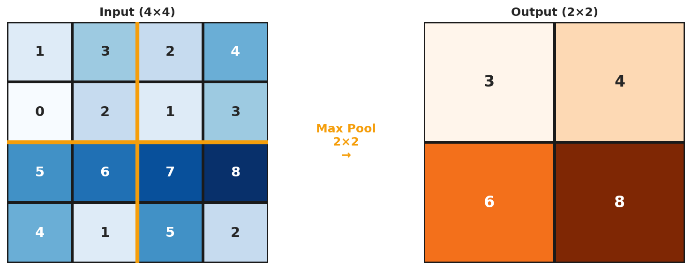

# Deep Dive: CNN Architecture

*Extends Module 7: Computer Vision & CNNs*

---

## Introduction

In Module 7, we learned that CNNs are dramatically more parameter-efficient than fully connected networks for images. But *why*? What makes convolution so special?

This deep dive explores the three principles that make CNNs work, walks through the convolution operation with concrete numbers, and shows exactly where parameters live in PyTorch's `nn.Conv2d`.

By the end, you'll understand not just *how* CNNs work, but *why* they're designed the way they are.

**Why weren't CNNs always used?** CNNs were discovered early (LeNet, 1989) but required computational resources that didn't exist. The 2012 AlexNet breakthrough combined sufficient data (ImageNet), compute (GPUs), and architecture improvements (ReLU, dropout). CNNs existed but weren't practical; FC networks and hand-crafted features (SIFT, HOG) were what people could actually train.

---

## The Parameter Explosion Problem

### Why Fully Connected Networks Fail for Images

Consider a standard image classification task:
- **Input**: 224 × 224 RGB image
- **Goal**: Classify into 1000 categories

If we flatten the image and connect to a hidden layer:

```
Input pixels: 224 × 224 × 3 = 150,528 features
Hidden layer: 1,000 neurons
Parameters: 150,528 × 1,000 = 150,528,000 (just the first layer!)
```

**That's 150 million parameters for ONE layer!**

A typical network might have several hidden layers:

| Layer | Input Size | Output Size | Parameters |
|-------|-----------|-------------|------------|
| FC1 | 150,528 | 4,096 | 616,562,688 |
| FC2 | 4,096 | 4,096 | 16,781,312 |
| FC3 | 4,096 | 1,000 | 4,097,000 |
| **Total** | | | **637,441,000** |

**637 million parameters** just to process a 224×224 image!

### The Problems This Creates

1. **Memory**: Each parameter is 4 bytes (float32)
   - 637M params × 4 bytes = 2.5 GB just for weights
   - Plus gradients, optimizer states: 10+ GB

2. **Overfitting**: More parameters than training examples
   - ImageNet has 1.2M training images
   - 637M parameters would massively overfit

3. **Computation**: Each forward pass multiplies huge matrices
   - Billions of multiply-add operations per image

4. **No spatial understanding**:
   - Pixel (0,0) and pixel (223,223) are equally "distant"
   - A cat in the corner looks completely different than a cat in the center

---

## The Three Principles That Save Parameters

CNNs achieve **99.9%+ parameter reduction** through three key principles:

### Principle 1: Local Connectivity (Sparse Connections)

**The insight**: Nearby pixels are related; distant pixels are less so.

Instead of connecting every input pixel to every hidden neuron, each neuron only "sees" a small local region called the **receptive field**.

**Connectivity Comparison:**

**Fully Connected**:
```
Every input pixel → Every hidden neuron
Connections: 150,528 × 1,000 = 150,528,000
```

**Locally Connected** (3×3 receptive field):
```
Each hidden neuron sees only 3×3×3 = 27 input values
Connections per neuron: 27
```


This mirrors the visual cortex: neurons in V1 respond to small regions of the visual field. Hubel & Wiesel won the Nobel Prize for discovering this.

**Brain inspiration**: CNNs were directly inspired by neuroscience—Hubel & Wiesel showed visual cortex neurons respond to simple patterns in small regions. Other brain-inspired ideas: the neuron model (McCulloch-Pitts), ReLU (firing thresholds), dropout (neural noise), attention (selective focus). Caution warranted: backpropagation has no clear biological analog; transformers aren't obviously brain-like.

### Principle 2: Weight Sharing (Translation Equivariance)

**The insight**: The same pattern can appear anywhere in an image.

A "vertical edge detector" should work whether the edge is in the top-left or bottom-right. Why learn separate detectors for each position?

**Without Weight Sharing** (Locally Connected):

If we had local connectivity but different weights at each position:

```
For 224×224 output with 3×3 filters:
Positions: 224 × 224 = 50,176
Parameters per position: 3 × 3 × 3 = 27
Total: 50,176 × 27 = 1,354,752 parameters (per filter)
```

Still a lot!

**With Weight Sharing** (Convolutional):

The same 3×3×3 filter is applied at every position:

```
Parameters: 3 × 3 × 3 + 1 (bias) = 28 parameters (per filter)
```

**That's a 50,000× reduction!**

**What This Enables: Translation Equivariance**

If you shift the input, the output shifts by the same amount:

$$f(\text{shift}(x)) = \text{shift}(f(x))$$

A cat detector fires whether the cat is at (10, 10) or (200, 200).

### Principle 3: Hierarchical Feature Learning

**The insight**: Complex features are built from simpler ones.

Through multiple layers, CNNs build a hierarchy:

| Layer Depth | Receptive Field | What's Learned | Example |
|-------------|-----------------|----------------|---------|
| Layer 1 | 3×3 | Edges, colors | Horizontal line, blue patch |
| Layer 2 | 7×7 | Textures, corners | Fur texture, eye corner |
| Layer 3 | 15×15 | Parts | Eye, ear, nose |
| Layer 4 | 31×31 | Objects | Cat face, dog face |
| Layer 5 | 63×63 | Scenes | Cat on couch |

**Effective Receptive Field Calculation:**

For a network with L layers of K×K convolutions:

$$\text{Receptive Field} = 1 + L \times (K - 1)$$

Example with 3×3 convolutions:
- After 1 layer: 1 + 1×2 = 3×3
- After 2 layers: 1 + 2×2 = 5×5
- After 5 layers: 1 + 5×2 = 11×11
- After 10 layers: 1 + 10×2 = 21×21

With pooling (stride 2), receptive field grows much faster—each pooling layer doubles the effective receptive field.

**Seeing the whole object**: The calculation above is without pooling—practical networks reach 200+ pixel receptive fields via pooling. More importantly, the network doesn't need every neuron to see the whole object. Hierarchical structure means different neurons specialize at different scales. Global average pooling aggregates information across all positions, giving the classifier access to features detected anywhere.

---

## The Savings Breakdown

Let's compare a CNN to an equivalent fully connected network:

### CNN Architecture (VGG-16 style, simplified)

| Layer | Output Shape | Parameters | Calculation |
|-------|-------------|------------|-------------|
| Input | 224×224×3 | 0 | - |
| Conv1 (3×3, 64) | 224×224×64 | 1,792 | 3×3×3×64 + 64 |
| Conv2 (3×3, 64) | 224×224×64 | 36,928 | 3×3×64×64 + 64 |
| MaxPool | 112×112×64 | 0 | - |
| ... | ... | ... | ... |
| Flatten | 25,088 | 0 | 7×7×512 |
| FC1 | 4,096 | 102,764,544 | 25,088×4,096 + 4,096 |
| **Conv layers total** | | **~9.5M** | |
| **FC layers total** | | **~123M** | |

The convolution layers have **~9.5 million parameters** vs potential **trillions** for equivalent FC layers.

| Principle | Savings Factor |
|-----------|----------------|
| Local Connectivity | ~150,000× (150,528 → ~27 connections) |
| Weight Sharing | ~50,000× (one filter for all positions) |
| Combined | **~7,500,000,000×** (billions) |

---

## Why Convolution Works for Images

### Property 1: Spatial Locality

**Nearby pixels are statistically related**

- Adjacent pixels often have similar values (smooth regions)
- Edges are local phenomena (sharp transitions between neighbors)
- Texture is defined by local patterns

**This justifies local connectivity**: Most useful information is local.

### Property 2: Stationarity

**The same patterns appear throughout the image**

- Edges can occur anywhere
- Textures repeat across regions
- Objects can appear at any location

**This justifies weight sharing**: One detector works everywhere.

### Property 3: Compositionality

**Complex patterns are built from simpler ones**

- Eyes are made of edges, curves, and colors
- Faces are made of eyes, nose, mouth
- Scenes are made of objects

**This justifies hierarchical layers**: Build complexity gradually.

### When Convolution Doesn't Work Well

CNNs struggle when these properties don't hold:

1. **Absolute position matters**:
   - Satellite imagery where "top" means north
   - Document layouts where header is always at top
   - Solution: Add positional encoding or coordinates

2. **Global context needed immediately**:
   - Recognizing objects from single distinctive features
   - Tasks requiring reasoning about entire image at once
   - Solution: Attention mechanisms, Vision Transformers

3. **Non-grid data**:
   - Graphs, point clouds, irregular meshes
   - Solution: Graph neural networks, PointNet

---

## The Convolution Operation In-Depth

Let's trace through a convolution with concrete numbers.

### Setup

- **Input**: 1 image, 3 channels (RGB), 8×8 pixels
  - Shape: `(1, 3, 8, 8)` - (batch, channels, height, width)

- **Filter**: 1 filter, 3×3 kernel
  - Shape: `(1, 3, 3, 3)` - (out_channels, in_channels, kernel_h, kernel_w)

- **Output**: 1 feature map, 6×6
  - Shape: `(1, 1, 6, 6)` - (batch, out_channels, height, width)

### The Sliding Window Process

For each position (i, j) in the output:

$$\text{output}[0, 0, i, j] = \sum_{c=0}^{2} \sum_{m=0}^{2} \sum_{n=0}^{2} \text{filter}[0, c, m, n] \times \text{input}[0, c, i+m, j+n] + \text{bias}[0]$$

### Concrete Example

Let's compute one output value at position (0, 0):

**Input patch** (top-left 3×3 of each channel):
```
Red channel:        Green channel:      Blue channel:
┌─────────────┐     ┌─────────────┐     ┌─────────────┐
│ 0.1 0.2 0.3 │     │ 0.4 0.5 0.6 │     │ 0.7 0.8 0.9 │
│ 0.2 0.3 0.4 │     │ 0.5 0.6 0.7 │     │ 0.8 0.9 1.0 │
│ 0.3 0.4 0.5 │     │ 0.6 0.7 0.8 │     │ 0.9 1.0 1.1 │
└─────────────┘     └─────────────┘     └─────────────┘
```

**Filter weights** (Sobel-like vertical edge detector):
```
Red weights:        Green weights:      Blue weights:
┌─────────────┐     ┌─────────────┐     ┌─────────────┐
│ 1   0  -1   │     │ 1   0  -1   │     │ 1   0  -1   │
│ 2   0  -2   │     │ 2   0  -2   │     │ 2   0  -2   │
│ 1   0  -1   │     │ 1   0  -1   │     │ 1   0  -1   │
└─────────────┘     └─────────────┘     └─────────────┘
```

**Computation**:
```python
# Red channel contribution
red = (0.1×1 + 0.2×0 + 0.3×(-1) +
       0.2×2 + 0.3×0 + 0.4×(-2) +
       0.3×1 + 0.4×0 + 0.5×(-1))
    = 0.1 - 0.3 + 0.4 - 0.8 + 0.3 - 0.5
    = -0.8

# Similarly for green and blue...
# Total (sum across channels) + bias
output[0,0,0,0] = red + green + blue + bias = -2.4
```

The filter slides across all valid positions to fill the 6×6 output.

### Output Size Formula

$$\text{output\_size} = \left\lfloor \frac{\text{input\_size} - \text{kernel\_size} + 2 \times \text{padding}}{\text{stride}} \right\rfloor + 1$$

For our example:

$$\frac{8 - 3 + 2 \times 0}{1} + 1 = 6$$

---

## Annotated nn.Conv2d Walkthrough

```python
import torch
import torch.nn as nn

# Create a convolutional layer
conv = nn.Conv2d(
    in_channels=3,      # RGB input
    out_channels=64,    # Number of filters (feature maps)
    kernel_size=3,      # 3×3 filter
    stride=1,           # Move 1 pixel at a time
    padding=1,          # Add 1 pixel border of zeros
    bias=True           # Include bias term
)

# WHERE THE PARAMETERS LIVE
print(f"Weight shape: {conv.weight.shape}")
# Output: torch.Size([64, 3, 3, 3])
# Interpretation: [out_channels, in_channels, kernel_height, kernel_width]
# - 64 different filters
# - Each filter has 3 channels (one for R, G, B)
# - Each channel is 3×3

print(f"Weight parameters: {conv.weight.numel()}")
# Output: 1728
# Calculation: 64 × 3 × 3 × 3 = 1,728

print(f"Bias shape: {conv.bias.shape}")
# Output: torch.Size([64])
# One bias per output channel (filter)

print(f"Total parameters: {sum(p.numel() for p in conv.parameters())}")
# Output: 1792
# = 1,728 (weights) + 64 (biases)
```

### Understanding the Weight Tensor

```python
# Access filter 0 (first of 64 filters)
filter_0 = conv.weight[0]  # Shape: [3, 3, 3]

# Filter 0's red channel weights
filter_0_red = conv.weight[0, 0]  # Shape: [3, 3]

# Filter 0's green channel weights
filter_0_green = conv.weight[0, 1]  # Shape: [3, 3]

# Filter 0's blue channel weights
filter_0_blue = conv.weight[0, 2]  # Shape: [3, 3]
```

### Visualizing Parameter Sharing

```python
# The SAME weights are used for EVERY spatial position
# This is what makes CNNs parameter-efficient

# These two output positions use the SAME filter weights:
# y[0, 0, 0, 0] uses conv.weight[0] applied at position (0,0)
# y[0, 0, 5, 5] uses conv.weight[0] applied at position (5,5)

# Without weight sharing, we'd need:
# 64 filters × 8×8 positions × 3×3×3 weights = 884,736 parameters
# With weight sharing:
# 64 filters × 3×3×3 weights = 1,728 parameters
# That's a 512× reduction!
```

---

## Pooling: Trading Resolution for Invariance

### What Max Pooling Does

**Max pooling** takes the maximum value in each patch:



### Why Max Pooling Works

1. **Translation invariance**: The feature's exact position within the pooling region doesn't matter
2. **Dimensionality reduction**: Halves spatial dimensions, reducing computation
3. **Increased receptive field**: Each pooled output sees a larger input region
4. **Slight noise robustness**: Small perturbations don't change the max

### Pooling vs Stride Trade-off

Modern networks often use **strided convolutions** instead of pooling:

| Approach | Operation | Parameters | Learned |
|----------|-----------|------------|---------|
| Max Pool | Take max | 0 | No |
| Avg Pool | Take mean | 0 | No |
| Strided Conv | Conv with stride 2 | kernel² × channels² | Yes |

**Strided convolution** can learn what information to preserve, but requires more parameters.

---

## Common Misconceptions

| Misconception | Reality |
|--------------|---------|
| "CNNs learn the filters by hand" | Filters are learned automatically through backpropagation, not designed by humans |
| "More filters is always better" | Diminishing returns; excess filters learn redundant or noise patterns |
| "CNNs work on any image task" | CNNs assume spatial locality and translation equivariance; they struggle when these don't hold |
| "The first layer must have 3 input channels" | Input channels match your data: 1 for grayscale, 3 for RGB, any number for multi-spectral |
| "Pooling is necessary" | Modern architectures often use strided convolutions instead |
| "Deeper is always better" | Without residual connections, very deep CNNs fail to train |

---

## Reflection Questions

1. If we didn't share weights across positions, how many parameters would a 3×3 conv layer have for a 224×224 image with 64 filters?

2. Why might a CNN struggle with satellite imagery where "up" always means north?

3. How does the receptive field grow through layers? Why does this matter?

4. A 7×7 conv has 49 weights per channel. Two stacked 3×3 convs have only 18 weights but achieve the same receptive field. What's the trade-off?

5. What happens if you set padding=0 with a 3×3 kernel on a 224×224 input?

6. Why do we typically increase the number of filters as we go deeper while decreasing spatial size?

---

## Practice Problems

1. Calculate parameters for VGG-16 from scratch

2. Compute output size for: input 64×64, kernel 5×5, stride 2, padding 2

3. Design a CNN for 64×64 grayscale images with target receptive field of 32×32

---

## Summary

**Key takeaways:**

1. **Local connectivity** reduces connections from millions to dozens per neuron

2. **Weight sharing** reduces parameters by 50,000× for a single filter

3. **Hierarchical learning** builds complex features from simple ones

4. These principles work because images have **spatial locality**, **stationarity**, and **compositionality**

5. The total savings is on the order of **billions of parameters**

6. Understanding where parameters live helps you reason about model capacity and design
