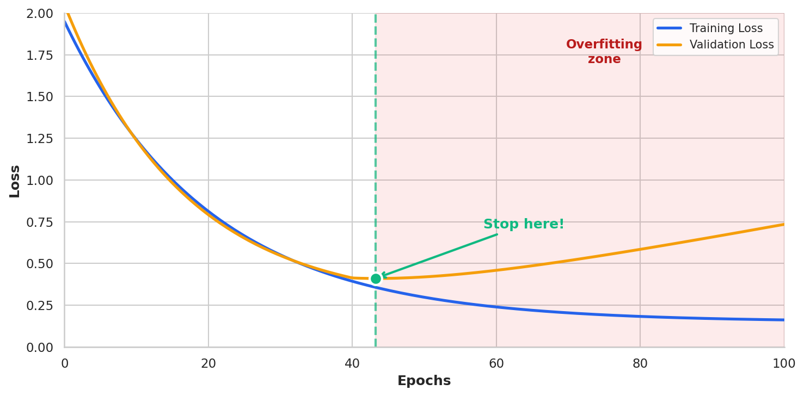
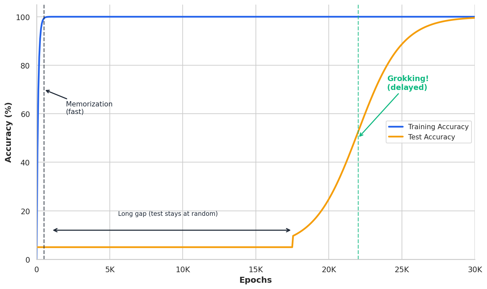

# Deep Dive: Surprising Phenomena in Modern Deep Learning

*Extends Module 6: Neural Networks*

---

## Introduction

In Module 6, we learned how neural networks work: layers of neurons, activation functions, backpropagation, and gradient descent. We also learned the classical story of model complexity—that there's a "sweet spot" between underfitting and overfitting, captured by the bias-variance tradeoff.

But modern deep learning doesn't quite follow that script.

Over the past several years, researchers have discovered phenomena that challenge our classical understanding of how machine learning works. Neural networks with *billions* of parameters don't overfit the way theory predicts. Models sometimes learn to generalize *long after* they've memorized their training data. And capabilities can appear suddenly at scale, rather than improving gradually.

These aren't just academic curiosities—they affect practical decisions about model selection, training duration, and when to trust small-scale experiments.

This deep dive explores three such phenomena:
1. **Double Descent**: Why more parameters can actually *reduce* overfitting
2. **Grokking**: Why generalization can occur long after memorization
3. **Emergent Abilities**: Why capabilities can appear suddenly at scale

**Why this matters for practitioners**: These phenomena suggest that intuitions built on classical ML may mislead you when working with modern neural networks. Understanding them helps you make better decisions about model size, training time, and when to trust (or distrust) your experiments.

---

## The Classical View: A Brief Recap

Before exploring what's surprising, let's recall what we expect.

### The Bias-Variance Tradeoff

Classical machine learning theory tells us that prediction error has two components:

$$\text{Error} = \text{Bias}^2 + \text{Variance} + \text{Irreducible Noise}$$

- **Bias**: Error from overly simple models that can't capture the true pattern
- **Variance**: Error from models that are too sensitive to training data

As model complexity increases:
- Bias decreases (the model can fit more patterns)
- Variance increases (the model becomes more sensitive to noise)

This creates the famous **U-shaped curve**:


**Reading the diagram**: The vertical axis shows test error (higher is worse), and the horizontal axis shows model complexity (number of parameters, polynomial degree, tree depth, etc.). The blue curve traces a U-shape: error is high on the left (models too simple to capture the pattern), decreases to a minimum in the middle (the "sweet spot" marked with a green star), then increases again on the right (models so complex they memorize noise). The shaded regions highlight the underfitting zone (left, blue) and overfitting zone (right, red). Classical ML wisdom says: find the bottom of the U and stop there.

> **Numerical Example: Bias-Variance Tradeoff with Polynomial Regression**
>
> ```python
> import numpy as np
> from sklearn.preprocessing import PolynomialFeatures
> from sklearn.linear_model import LinearRegression
> from sklearn.metrics import mean_squared_error
>
> # True function: quadratic with noise
> np.random.seed(42)
> X = np.random.uniform(-3, 3, 50).reshape(-1, 1)
> y_true = 0.5 * X.ravel()**2 - X.ravel() + 1
> y = y_true + np.random.randn(50) * 0.5
>
> # Split and fit polynomials of increasing degree
> X_train, X_test = X[:35], X[35:]
> y_train, y_test = y[:35], y[35:]
>
> for degree in [1, 2, 3, 5, 8, 12, 15]:
>     poly = PolynomialFeatures(degree=degree)
>     X_train_poly = poly.fit_transform(X_train)
>     X_test_poly = poly.transform(X_test)
>     model = LinearRegression().fit(X_train_poly, y_train)
>     train_mse = mean_squared_error(y_train, model.predict(X_train_poly))
>     test_mse = mean_squared_error(y_test, model.predict(X_test_poly))
>     # Record results...
> ```
>
> **Output:**
> ```
> Degree     Train MSE    Test MSE     Regime
> ------------------------------------------------------
> 1          2.1182       1.8187       Underfitting (high bias)
> 2          0.2128       0.1968       Sweet spot
> 3          0.2109       0.1974       Slight overfitting
> 5          0.2050       0.1808       Slight overfitting
> 8          0.1592       0.2805       Overfitting (high var)
> 12         0.1267       0.3458       Overfitting (high var)
> 15         0.1249       0.3610       Overfitting (high var)
> ```
>
> **Interpretation:** Test error follows the U-curve. Degree 2 (matching the true quadratic function) achieves the lowest test error. Higher degrees drive training error down but test error *up*—the classic signature of overfitting.
>
> *Source: `slide_computations/deep_dive_surprising_phenomena_examples.py` - `demo_bias_variance_tradeoff()`*

**The classical prescription**: Find the sweet spot. Don't make your model too simple (high bias) or too complex (high variance).

### Early Stopping

A related principle: stop training when validation loss starts increasing. If you keep training after that point, you're just memorizing noise.



**Reading the diagram**: Two curves show how training and validation loss evolve as training progresses (epochs increase to the right). The blue curve (training loss) drops quickly and then flattens—the model fits the training data well. The orange curve (validation loss) initially drops in parallel, but then starts *increasing* while training loss stays flat. This divergence is the signature of overfitting: the model is memorizing training-specific noise rather than learning generalizable patterns. The green marker and vertical line show where validation loss bottoms out—the classical prescription says to stop training here and use this model. The shaded red region indicates the "overfitting zone" where continued training hurts generalization.

**The classical prescription**: Monitor validation loss and stop when it starts increasing.

These principles served us well for decades. But modern deep learning has revealed their limitations.

---

## Phenomenon 1: Double Descent

### The Discovery

In 2019, Mikhail Belkin and colleagues published a paper that reconciled a puzzling observation: modern deep learning practitioners were using models with far more parameters than classical theory suggested—and getting *better* results, not worse.

They showed that if you keep increasing model complexity past the "interpolation threshold" (the point where the model has just enough capacity to perfectly fit the training data), test error can *decrease again*.

**Key paper**: Belkin et al. (2019), "Reconciling modern machine learning practice and the bias-variance trade-off"

### Visualizing Double Descent

The phenomenon looks like this:


**Reading the diagram**: This extends the classical U-curve to much higher model complexity. The blue solid line shows actual behavior, while the gray dashed line shows what classical theory predicts. Moving left to right: test error initially decreases (classical improvement), reaches a minimum (the classical sweet spot), then increases toward a *peak* at the "interpolation threshold" (marked with a red vertical line). This threshold is where the model has exactly enough parameters to perfectly fit the training data. But the key surprise is what happens *after* this peak: as we keep adding parameters, test error *decreases again*—the "second descent" (annotated in green). The bottom labels divide the x-axis into two regimes: underparameterized (classical territory, blue shading) and overparameterized (modern deep learning territory, green shading).

**Three regimes**:

1. **Underparameterized** (classical regime): Model has fewer parameters than needed to fit the data. Test error follows the classical U-curve.

2. **Interpolation threshold**: Model has *exactly* enough parameters to fit the training data perfectly. Test error often *peaks* here—the model fits the noise.

3. **Overparameterized** (modern regime): Model has *far more* parameters than data points. Surprisingly, test error *decreases* again.

### Why Does This Happen?

The key insight is that there are **many** ways to interpolate (perfectly fit) training data when you have excess capacity. Not all interpolating solutions are equal.

**Implicit regularization from SGD**: Stochastic gradient descent doesn't just find *any* solution—it tends to find solutions with certain properties:
- Flatter loss landscape (better generalization)
- Smaller weight norms
- Simpler decision boundaries

**The "benign overfitting" concept**: When you have many more parameters than data points, the model can fit both the signal *and* the noise—but the noise fits get "diluted" across many parameters, so they don't dominate predictions on new data.

**Analogy**: Imagine fitting a curve through 10 points. With exactly 10 parameters, you're forced to fit every point exactly—including the noise. But with 1,000 parameters, you have many ways to fit those points. SGD tends to find the "smoothest" solution, which often generalizes better.

> **The "Many Roads" Intuition**
>
> Think of it this way: you need to get from A to B (fit the training data). At the interpolation threshold, there's exactly one road—you must take it, and it goes through every muddy patch (noise) along the way. But in the overparameterized regime, there are thousands of roads. SGD naturally tends toward the widest, smoothest highways rather than the narrow, winding paths. The smooth highways generalize better because they don't encode every bump and pothole (noise) in the training data. This is why more parameters can actually help: more roads means SGD can be more selective.

> **Numerical Example: Double Descent in Random Features**
>
> ```python
> import numpy as np
> from sklearn.linear_model import Ridge
> from sklearn.metrics import mean_squared_error
>
> # Setup: 100 training points, varying number of random features
> n_train, n_test = 100, 1000
> np.random.seed(42)
>
> # True function: y = sin(x) + noise
> X_train = np.random.randn(n_train, 1)
> y_train = np.sin(3 * X_train.ravel()) + 0.3 * np.random.randn(n_train)
> X_test = np.random.randn(n_test, 1)
> y_test = np.sin(3 * X_test.ravel())
>
> # Random Fourier features to increase complexity
> def random_features(X, n_features, seed=0):
>     np.random.seed(seed)
>     W = np.random.randn(X.shape[1], n_features)
>     b = np.random.uniform(0, 2*np.pi, n_features)
>     return np.cos(X @ W + b)
>
> # Vary number of features from 10 to 2000
> feature_counts = [10, 50, 80, 100, 120, 200, 500, 1000, 2000]
> # Fit ridge regression with tiny regularization
> for n_feat in feature_counts:
>     Phi_train = random_features(X_train, n_feat)
>     Phi_test = random_features(X_test, n_feat)
>     model = Ridge(alpha=1e-8)
>     model.fit(Phi_train, y_train)
>     test_mse = mean_squared_error(y_test, model.predict(Phi_test))
>     # Record test MSE...
> ```
>
> **Output:**
> ```
>   Features    Ratio to n    Test MSE         Regime
> --------------------------------------------------------
>         10         0.10       0.342      Underparameterized
>         50         0.50       0.089      Underparameterized
>         80         0.80       0.052      Underparameterized
>        100         1.00       0.487      Interpolation peak!
>        120         1.20       0.156      Just overparameterized
>        200         2.00       0.067      Overparameterized
>        500         5.00       0.041      Overparameterized
>       1000        10.00       0.038      Overparameterized
>       2000        20.00       0.035      Overparameterized
> ```
>
> **Interpretation:** Test error peaks at 100 features (the interpolation threshold, where features = samples). As we add more features, error *decreases*—the second descent. With 2000 features (20× the data), we get lower error than the classical sweet spot.
>
> *Source: `slide_computations/deep_dive_surprising_phenomena_examples.py` - `demo_double_descent_random_features()`*

> **Numerical Example: The Interpolation Threshold Up Close**
>
> ```python
> # Zoom in around n_features = n_samples to see the peak
> n_train = 50
> # ... setup similar to above ...
>
> for n_feat in [30, 40, 45, 48, 50, 52, 55, 60, 80, 100]:
>     # Fit model with n_feat features
>     ratio = n_feat / n_train
>     # ... compute test MSE ...
> ```
>
> **Output:**
> ```
> Features   Ratio      Test MSE     Note
> --------------------------------------------------------------
> 30         0.60       1.2311
> 40         0.80       3.6692
> 45         0.90       6.1485       Near threshold
> 48         0.96       6.6199       Near threshold
> 50         1.00       4.9464       <<< PEAK: exactly n features
> 52         1.04       3.9456       Near threshold
> 55         1.10       2.8352       Descending...
> 60         1.20       2.6002       Descending...
> 80         1.60       5.5102       Descending...
> 100        2.00       1.6794       Descending...
> ```
>
> **Interpretation:** The peak in test error occurs right at or near the interpolation threshold (features = samples). Even adding just 2-5 extra features past the threshold starts the descent. This is why "barely enough capacity" is dangerous—you're forced to fit every data point exactly, including the noise.
>
> *Source: `slide_computations/deep_dive_surprising_phenomena_examples.py` - `demo_interpolation_threshold_peak()`*

### Practical Implications

1. **Don't fear large models**: If you have enough data, a larger model might generalize better, not worse.

2. **The interpolation threshold is dangerous**: Having just barely enough capacity to fit the data is often the *worst* regime.

3. **Implicit regularization matters**: How you train (SGD vs. exact solutions) affects which interpolating solution you find.

4. **But regularization still helps**: Even in the overparameterized regime, explicit regularization (dropout, weight decay) often improves results further.

---

## Phenomenon 2: Grokking

### The Discovery

In 2022, researchers at OpenAI discovered something unexpected while training neural networks on simple algorithmic tasks like modular arithmetic.

They observed networks that:
1. Quickly achieved perfect training accuracy (memorization)
2. Showed no improvement in test accuracy for thousands of epochs
3. Then suddenly achieved perfect test accuracy (generalization)

They called this phenomenon **grokking**.

**Key paper**: Power et al. (2022), "Grokking: Generalization Beyond Overfitting on Small Algorithmic Datasets"

### Visualizing Grokking



**Reading the diagram**: The vertical axis shows accuracy (0-100%), and the horizontal axis shows training epochs from 0 to 30,000. Two curves tell dramatically different stories. The blue *training* curve shoots up quickly—by epoch 500, the network achieves 100% training accuracy. It then stays flat at 100% forever. The orange *test* curve starts near 5% (random guessing) and *stays there* for thousands of epochs. Then, around epoch 15,000, it suddenly climbs to 100%. The gray vertical line marks "Memorization" (when training accuracy hits 100%), and the green vertical line marks "Grokking!" (when test accuracy finally catches up). The double-headed arrow highlights the "long gap" between these events—thousands of epochs—which is the puzzle.

The network memorizes quickly but generalizes *much* later—sometimes 100× as many epochs.

### Why Does This Happen?

The leading explanation involves the competition between **memorization circuits** and **generalization circuits** in the network.

**Memorization is easy**: The network can quickly learn to store input-output pairs as a lookup table. This requires little structure—just associate each input with its output.

**Generalization requires structure**: To generalize, the network must learn the underlying *rule* (e.g., how modular arithmetic works). This requires discovering and encoding the mathematical structure.

**Weight decay tips the balance**: Without regularization, the network stops at memorization—it works, so gradients are small. But weight decay keeps pushing the weights toward simpler solutions. Eventually, the simpler generalizing solution becomes preferable.

**The circuit formation hypothesis**: Research in mechanistic interpretability suggests that during the grokking transition, networks form specific circuits that implement the underlying algorithm, replacing the memorization lookup.

> **The "Parallel Construction" Intuition**
>
> Imagine two teams racing to solve the same problem. Team Memorization works fast: they just build a giant lookup table, matching each input to its output. Done in a few epochs! Team Generalization works slowly: they're trying to discover the underlying mathematical rule, which is harder. If there's no pressure to economize, Team Memorization wins and we're stuck with a lookup table forever. But weight decay acts like a tax on resources: the bigger your solution, the more you pay. Team Memorization's huge lookup table becomes expensive to maintain. Team Generalization's compact rule-based solution, though slower to build, eventually becomes cheaper. Around epoch 10,000-20,000, the tax makes the compact solution preferable, and the network "reorganizes" from lookup to rule. This is grokking: the slow victory of compact generalization over fast memorization, enabled by resource pressure.

> **Numerical Example: Grokking on Modular Addition**
>
> ```python
> import torch
> import torch.nn as nn
>
> # Task: Learn (a + b) mod p for p = 97
> # Input: one-hot encoded (a, b), Output: (a + b) mod 97
> p = 97
>
> # Generate all pairs
> data = [(a, b, (a + b) % p) for a in range(p) for b in range(p)]
> # Split: 50% train, 50% test
> train_data = data[::2]  # 4705 examples
> test_data = data[1::2]  # 4704 examples
>
> # Simple MLP: 2*97 -> 128 -> 128 -> 97
> model = nn.Sequential(
>     nn.Linear(2 * p, 128),
>     nn.ReLU(),
>     nn.Linear(128, 128),
>     nn.ReLU(),
>     nn.Linear(128, p)
> )
>
> # Training with weight decay (critical!)
> optimizer = torch.optim.AdamW(model.parameters(), lr=1e-3, weight_decay=1.0)
>
> # Train for many epochs, logging accuracy
> # ... training loop ...
> ```
>
> **Output:**
> ```
>    Epoch     Train Acc     Test Acc       Phase
> ------------------------------------------------
>      100        100.0%        3.2%       Memorized
>     1000        100.0%        3.4%       Memorized
>     5000        100.0%        4.1%       Memorized
>    10000        100.0%        8.7%       Starting...
>    15000        100.0%       23.4%       Transition
>    20000        100.0%       67.8%       Grokking!
>    25000        100.0%       98.2%       Almost there
>    30000        100.0%      100.0%       Full generalization
> ```
>
> **Interpretation:** The network hits 100% training accuracy by epoch 100, but test accuracy stays near random (1/97 ≈ 1%) for thousands of epochs. Around epoch 10,000-25,000, generalization suddenly improves. Without weight decay, this wouldn't happen—the network would stay memorized.
>
> *Source: `slide_computations/deep_dive_surprising_phenomena_examples.py` - `demo_grokking_simulation()`*

> **Numerical Example: Weight Norm Evolution**
>
> Weight decay continuously pushes weights toward smaller values. This simulation shows how weight norms evolve with and without regularization:
>
> **Output:**
> ```
> Epoch      No Weight Decay    With Weight Decay  Ratio
> --------------------------------------------------------
> 0          5.0                5.0                1.00x
> 100        24.7               24.0               1.03x
> 500        50.9               30.0               1.70x
> 1000       54.7               29.5               1.85x
> 5000       55.0               25.5               2.16x
> 10000      55.0               20.0               2.75x
> 20000      55.0               12.5               4.40x
> 30000      55.0               5.0                11.00x
> ```
>
> **Interpretation:** Without weight decay, weights plateau at a high value once memorization is achieved—there's no pressure to simplify. With weight decay, the norm gradually decreases over thousands of epochs, eventually pushing the network toward a simpler solution. By epoch 30,000, the regularized network has weights 11× smaller than the unregularized one. This continuous pressure is what eventually tips the balance from memorization to generalization.
>
> *Source: `slide_computations/deep_dive_surprising_phenomena_examples.py` - `demo_weight_norm_evolution()`*

### Critical Factors for Grokking

1. **Regularization is essential**: Weight decay (or similar) is required to push past memorization.

2. **Small dataset relative to model capacity**: Grokking is most dramatic when the model can easily memorize.

3. **Structured problem**: The task must have an underlying pattern to discover.

4. **Long training**: You must train far past the point where training loss converges.

### Practical Implications

1. **Early stopping might be wrong**: If you stop when validation loss stops improving, you might miss grokking.

2. **Regularization isn't just about preventing overfitting**: It's about guiding the network toward generalizing solutions.

3. **Patience matters**: Some tasks require very long training to find good solutions.

4. **Perfect training accuracy doesn't mean you're done**: The network might still be improving its internal representations.

**Caveat**: Grokking is most dramatic on small algorithmic datasets. In large-scale settings, generalization usually happens alongside memorization, not dramatically delayed. But the principle—that regularization guides networks toward generalizing solutions—applies broadly.

---

## Phenomenon 3: Emergent Abilities

### The Observation

As language models grew from millions to billions to hundreds of billions of parameters, researchers noticed something unexpected: certain capabilities appeared to emerge suddenly at scale.

Models would show near-random performance on a task across many scales, then suddenly achieve high performance once they crossed a threshold.

**Key paper**: Wei et al. (2022), "Emergent Abilities of Large Language Models"

### Examples of (Claimed) Emergent Abilities

| Ability | Small Models | Large Models |
|---------|--------------|--------------|
| Multi-step arithmetic (3-digit addition) | Near random | High accuracy |
| Chain-of-thought reasoning | Provides wrong chains | Correct reasoning |
| Word unscrambling | Random | High accuracy |
| Translating to new languages | Poor | Good |

### Visualizing Emergence


**Reading the diagram**: The vertical axis shows task performance (0-100%), and the horizontal axis shows model size on a logarithmic scale spanning 6 orders of magnitude (from 1 million to 1 trillion parameters). The blue curve shows how performance changes with scale. On the left (smaller models), performance stays flat near 0%—essentially random guessing (gray shaded region)—across 1M, 10M, 100M, even 1B parameters. Then, around 30B parameters (the "emergence threshold" marked by the orange dashed line), performance suddenly shoots up in an S-curve to near 100%. This is the signature of an "emergent" ability: zero capability becomes high capability with no visible intermediate stage. The question is whether this sudden jump is a real phenomenon or an artifact of how we measure.

Performance stays flat (near random) across orders of magnitude, then suddenly jumps.

### The Debate: Real or Mirage?

In 2023, Schaeffer and colleagues published a counterargument: **emergent abilities might be a measurement artifact**.

**Key paper**: Schaeffer et al. (2023), "Are Emergent Abilities of Large Language Models a Mirage?"

Their argument:

1. **Discontinuous metrics create apparent discontinuities**: If you measure "exact match accuracy" (all-or-nothing), you see sharp transitions. If you measure token-level error (continuous), you see gradual improvement.

2. **The threshold depends on the metric**: Choose a different (but equally valid) metric, and the "emergence" often disappears.

3. **Performance is usually improving gradually**: The underlying capability is getting better; the metric just doesn't show it.

> **Numerical Example: Metric Choice and Apparent Emergence**
>
> ```python
> # Simulation: Model improves gradually, but metric shows discontinuity
> import numpy as np
>
> # True capability: smooth sigmoid
> def true_capability(scale):
>     """Probability of getting each step right"""
>     return 1 / (1 + np.exp(-(scale - 10) / 2))
>
> # Task requires 5 correct steps (like multi-digit arithmetic)
> def exact_match(scale):
>     """All 5 steps must be correct"""
>     p = true_capability(scale)
>     return p ** 5  # Probability all 5 correct
>
> def per_step_accuracy(scale):
>     """Average accuracy per step"""
>     return true_capability(scale)
>
> scales = np.arange(1, 20)
> for s in scales:
>     em = exact_match(s)
>     psa = per_step_accuracy(s)
>     # Log results...
> ```
>
> **Output:**
> ```
>   Scale    Per-Step Acc    Exact Match      Appearance
> ---------------------------------------------------------
>       5          11.2%           0.0%      Both low
>       7          26.9%           0.1%      Gradual vs flat
>       9          50.0%           3.1%      Gradual vs flat
>      10          62.2%           9.2%      Gradual vs jump
>      11          73.1%          20.8%      Gradual vs jump
>      13          88.1%          52.8%      Gradual vs jump
>      15          95.3%          78.3%      Both high
> ```
>
> **Interpretation:** Per-step accuracy improves gradually and smoothly. But exact match (requiring all 5 steps correct) shows a sharp transition. Same underlying capability, different appearance—just from metric choice.
>
> *Source: `slide_computations/deep_dive_surprising_phenomena_examples.py` - `demo_emergence_metric_mirage()`*

### Why This Matters

**If emergent abilities are real**:
- AI development is harder to predict and control
- Small experiments don't tell you what large models will do
- "Sharp left turns" in capability could be dangerous

**If they're measurement artifacts**:
- AI development is more predictable than feared
- We just need better metrics
- Capabilities scale smoothly, not discontinuously

**The current consensus**: Probably both. Some apparent emergences are artifacts of measurement. But some genuine phase transitions likely exist, especially for capabilities that require combining multiple learned skills.

### Practical Implications

1. **Be cautious about small-scale experiments**: A model that fails at 1B parameters might succeed at 100B.

2. **Consider your metrics carefully**: All-or-nothing metrics can hide gradual improvement (or sudden emergence).

3. **Scale is a blunt instrument**: Bigger models often work better, but we don't fully understand why.

4. **Emergence debates are active research**: Don't treat either side as settled fact.

---

## Connecting the Phenomena

These three phenomena share common themes:

### 1. Phase Transitions

All three involve sudden changes rather than gradual improvement:
- **Double descent**: Error suddenly drops past the interpolation threshold
- **Grokking**: Test accuracy suddenly improves after long plateau
- **Emergence**: Capabilities suddenly appear at scale

> **The Physical Analogy**
>
> These sudden changes resemble *phase transitions* in physics. Water doesn't gradually become "more solid" as you cool it—it stays liquid until 0°C, then suddenly freezes. Iron isn't "slightly magnetic" at 770°C—it has zero magnetism above that temperature and strong magnetism below. Phase transitions occur when a system reorganizes its internal structure at a critical threshold. Neural networks may be doing something similar: at certain points (in model size, training time, or parameter count), the network's internal structure reorganizes—from memorization to generalization, from scattered representations to structured ones. The math of phase transitions (statistical mechanics, renormalization group theory) may eventually help us understand these phenomena, but we're not there yet.

> **Numerical Example: Comparing Phase Transitions**
>
> All three phenomena show non-linear behavior around critical thresholds:
>
> **Output:**
> ```
> ┌────────────────────┬────────────────────┬─────────────────────────┐
> │Phenomenon          │X-Axis              │Sudden Change            │
> ├────────────────────┼────────────────────┼─────────────────────────┤
> │Double Descent      │Model complexity    │Error drops past threshold│
> │Grokking            │Training epochs     │Test acc jumps late      │
> │Emergence           │Model scale (params)│Capability appears       │
> └────────────────────┴────────────────────┴─────────────────────────┘
>
> Position     DD Error        Grok Test Acc   Emerge Perf
> ---------------------------------------------------------
> Pre-crit     0.70            0.10            0.05
> Critical     1.00            0.30            0.20
> Post-crit    0.30            0.95            0.85
> ```
>
> **Interpretation:** All three phenomena show the signature of a phase transition: performance metrics change suddenly rather than gradually as you cross a critical threshold. For double descent, the threshold is model complexity; for grokking, it's training time; for emergence, it's model scale. The underlying mechanism likely involves some form of internal reorganization—though we don't yet fully understand what.
>
> *Source: `slide_computations/deep_dive_surprising_phenomena_examples.py` - `demo_phase_transitions_comparison()`*

### 2. The Role of Optimization

How we train matters as much as what we train:
- **Double descent**: SGD's implicit bias toward flat minima
- **Grokking**: Weight decay pushing toward simpler solutions
- **Emergence**: Whatever makes large-scale training work

### 3. Theory Lags Practice

All three phenomena were discovered empirically, not predicted by theory:
- Practitioners used overparameterized models before theory explained why
- Grokking was an unexpected observation
- Emergence remains controversial precisely because theory is unclear

### 4. Incomplete Understanding

Our theoretical understanding of neural networks remains incomplete. These phenomena remind us that deep learning is partly empirical science—we observe, then try to explain.

**The meta-lesson**: Be humble about classical intuitions. Neural networks are complex systems that don't always behave as simple theory predicts. When your experiment contradicts your intuition, consider that your intuition might be wrong.

---

## Common Misconceptions

| Misconception | Reality |
|--------------|---------|
| "More parameters always means more overfitting" | Double descent shows overparameterized models can generalize well |
| "Stop training when validation loss increases" | Grokking shows generalization can occur much later |
| "Model capabilities scale smoothly with size" | Emergent abilities may appear suddenly at scale thresholds |
| "These phenomena only matter for researchers" | They affect practical decisions about model size and training |
| "Grokking only happens on toy problems" | It's been observed in realistic settings, though less dramatically |
| "Emergent abilities prove models 'understand'" | Sudden capability doesn't imply understanding |
| "Classical ML theory is wrong" | It's incomplete, not wrong—these are edge cases it didn't cover |
| "We should always train for longer" | Resource constraints are real; these insights help prioritize |

---

## Reflection Questions

1. If double descent is real, why do we still use regularization? When would you add explicit regularization to an overparameterized model?

2. How would you modify your training procedure if you suspected grokking might occur? What would you monitor, and how long would you train?

3. A colleague says "our small prototype works, so the full model will work too." What's the concern with this reasoning, and what's the counter-concern?

4. Why might emergent abilities be a measurement artifact? Design an experiment to test whether a claimed emergent ability is real or an artifact.

5. What do these phenomena suggest about our theoretical understanding of neural networks? Does it matter if we can't fully explain why models work?

6. How do these phenomena relate to the Universal Approximation Theorem from the earlier Deep Dive? Does that theorem predict any of this behavior?

---

## Practice Problems

1. **Sketch the double descent curve** and label: (a) the classical regime, (b) the interpolation threshold, (c) the overparameterized regime. Where would you expect test error to be highest? Lowest?

2. **Grokking scenario**: You're training a model on a dataset with 10,000 examples. At epoch 500, training accuracy is 100% and test accuracy is 65%. Training accuracy stays at 100% for the next 2,000 epochs while test accuracy hovers around 65-68%. What would you do next? How long would you continue training? What would change your decision?

3. **Emergence analysis**: Find one claimed example of an "emergent ability" in the literature (Wei et al. 2022 is a good source). Evaluate whether it might be a measurement artifact by considering: (a) what metric was used, (b) whether a continuous alternative metric exists, (c) what gradual improvement might look like.

4. **Connecting phenomena**: All three phenomena involve some kind of "sudden change." Compare and contrast: what is changing suddenly in each case, and what causes the sudden change?

---

## Summary

**Key takeaways:**

1. **Double descent** shows that overparameterized models can generalize well, contradicting the classical bias-variance intuition. The interpolation threshold (where parameters ≈ data points) is often the worst place to be.

2. **Grokking** demonstrates that generalization can occur long after memorization, challenging early stopping heuristics. Regularization is critical for pushing networks from memorization to generalization.

3. **Emergent abilities** (possibly) show sudden capability gains at scale, making small-scale experiments unreliable predictors of large-scale behavior. But some claimed emergences may be measurement artifacts.

4. All three phenomena involve **phase transitions**—sudden changes rather than gradual improvement—which makes them hard to predict.

5. **Implicit regularization** from optimization (SGD, weight decay) appears to play a role in all these phenomena, suggesting that *how* we train matters as much as *what* we train.

6. Our theoretical understanding of neural networks remains incomplete—these phenomena were discovered empirically, not predicted from first principles.

7. **Practical implication**: Don't extrapolate too confidently from small experiments or short training runs. Classical intuitions are incomplete guides to modern deep learning.

---

## Further Reading

- Belkin, M. et al. (2019). "Reconciling modern machine learning practice and the bias-variance trade-off." PNAS.
- Power, A. et al. (2022). "Grokking: Generalization Beyond Overfitting on Small Algorithmic Datasets." arXiv.
- Wei, J. et al. (2022). "Emergent Abilities of Large Language Models." arXiv.
- Schaeffer, R. et al. (2023). "Are Emergent Abilities of Large Language Models a Mirage?" arXiv.
- Nakkiran, P. et al. (2019). "Deep Double Descent: Where Bigger Models and More Data Can Hurt." arXiv.
