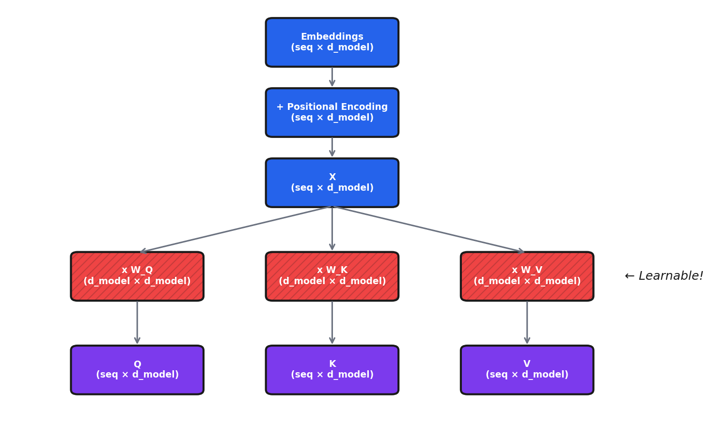

# Deep Dive: Transformer Architecture

*Extends Module 8: Natural Language Processing*

---

## Introduction

In Module 8, we learned that transformers use self-attention to process sequences. We covered the high-level concepts of Query, Key, Value and the attention formula.

This deep dive goes deeper. We'll trace through the exact matrix dimensions at each step, see exactly where the learnable parameters live, and build a complete transformer from scratch in PyTorch.

By the end, you'll understand not just *what* transformers do, but *how* they do it—down to the individual matrix operations.

**What parameters learn**: Token embeddings learn dense representations where similar words cluster together. Attention projections (W_Q, W_K, W_V) learn relevance between tokens—W_Q learns what tokens "look for," W_K what they "offer," W_V what information to pass. FFNs appear to store factual knowledge as distributed key-value memories. Layer norms stabilize training.

---

## Where Parameters Live in a Transformer

Understanding where the learnable parameters actually reside is crucial for understanding what the model "learns" during training.

### Parameter Overview

For a transformer with:
- `vocab_size` = 30,000 (vocabulary)
- `d_model` = 512 (model dimension)
- `n_heads` = 8 (attention heads)
- `d_k = d_v` = 64 (dimension per head = d_model / n_heads)
- `d_ff` = 2048 (feedforward hidden dimension, typically 4× d_model)
- `n_layers` = 6 (number of transformer blocks)
- `max_seq_len` = 512 (maximum sequence length)

**Why 4× expansion in FFN?** Largely empirical—it worked well in the original paper. The expansion provides "intermediate reasoning space." Too small (2×) limits expressivity; too large (8×) adds parameters with diminishing returns. Some efficient transformers use 2-2.67×; the ratio isn't sacred if you have specific constraints.

### Token Embedding Matrix

**Shape**: `(vocab_size, d_model)` = `(30000, 512)`

**Parameters**: 15,360,000

**What it learns**: A dense vector representation for each token in the vocabulary. This is the "lookup table" that converts token IDs to continuous vectors.

**How similar embeddings emerge**: Word relationships emerge from the training objective (distributional hypothesis). Tokens in similar contexts ("cat" and "dog" both appear in "the ___ ran across the yard") get similar embeddings. The model learns they're interchangeable in many contexts. Subtle relationships emerge too: "king" – "man" + "woman" ≈ "queen." None is programmed—it falls out of optimizing prediction accuracy.

```python
self.token_embedding = nn.Embedding(
    num_embeddings=vocab_size,  # 30,000
    embedding_dim=d_model        # 512
)
# Weight shape: (30000, 512)
```

### Positional Encoding / Embedding

**Sinusoidal (Original Transformer)**: No learnable parameters—computed deterministically

**Learned Positional Embedding**:
- **Shape**: `(max_seq_len, d_model)` = `(512, 512)`
- **Parameters**: 262,144

```python
# Learned positional embeddings
self.pos_embedding = nn.Embedding(
    num_embeddings=max_seq_len,  # 512
    embedding_dim=d_model         # 512
)
```

### Attention Layer Parameters (Per Layer)

Each attention layer has four weight matrices:

| Matrix | Shape | Parameters | Purpose |
|--------|-------|------------|---------|
| W_Q | `(d_model, d_model)` | 512 × 512 = 262,144 | Projects input to queries |
| W_K | `(d_model, d_model)` | 512 × 512 = 262,144 | Projects input to keys |
| W_V | `(d_model, d_model)` | 512 × 512 = 262,144 | Projects input to values |
| W_O | `(d_model, d_model)` | 512 × 512 = 262,144 | Projects concatenated heads to output |
| **Biases** | 4 × `(d_model)` | 4 × 512 = 2,048 | One bias per projection |

**Total per attention layer**: ~1,050,624 parameters

**Key insight**: Even though we have 8 heads, the total parameter count is the same as if we had one big head. The "heads" are created by reshaping, not by adding parameters.

**Why multiple heads help**: They enable attending to different relationships simultaneously—syntactic, semantic, positional. Research finds heads that specialize: one attends to grammatical antecedents, another to adjacent tokens. This specialization emerges during training. Trade-off: each head has smaller d_k, but specialization benefits outweigh capacity reduction.

### Feed-Forward Network (Per Layer)

The FFN applies two linear transformations with a non-linearity:

$$\text{FFN}(x) = \text{ReLU}(xW_1 + b_1)W_2 + b_2$$

| Matrix | Shape | Parameters | Purpose |
|--------|-------|------------|---------|
| W_1 | `(d_model, d_ff)` | 512 × 2048 = 1,048,576 | Expand to higher dimension |
| b_1 | `(d_ff)` | 2,048 | Bias for expansion |
| W_2 | `(d_ff, d_model)` | 2048 × 512 = 1,048,576 | Contract back to model dimension |
| b_2 | `(d_model)` | 512 | Bias for contraction |

**Total per FFN**: ~2,099,712 parameters

**FFN as knowledge storage**: Research supports this hypothesis. Specific FFN neurons activate for specific concepts ("The capital of France is ___" triggers neurons contributing "Paris"). Researchers have edited factual knowledge by modifying FFN weights. Attention handles "routing" (context-dependent); FFN handles fixed transformations. Fixed parameters suit stable facts; dynamic computation suits context-dependent processing.

### Layer Normalization (Per Layer)

Each transformer block typically has 2 layer norms:

| Component | Shape | Parameters |
|-----------|-------|------------|
| Scale (γ) | `(d_model)` | 512 |
| Shift (β) | `(d_model)` | 512 |

**Total per layer norm**: 1,024 parameters
**Total per transformer block**: 2,048 parameters (2 layer norms)

**Why layer norm matters**: Without it, activations grow/shrink exponentially through layers—causing gradient explosion/vanishing. Layer norm keeps activations stable regardless of depth. The learned γ and β parameters let the model recover useful mean/variance. Appears twice per block (before attention, before FFN) because both operations can distort statistics.

### Parameter Count Summary

| Component | Count | Parameters Each | Total |
|-----------|-------|-----------------|-------|
| Token Embedding | 1 | 15,360,000 | 15,360,000 |
| Positional Embedding | 1 | 262,144 | 262,144 |
| Attention Layers | 6 | ~1,050,624 | ~6,303,744 |
| FFN Layers | 6 | ~2,099,712 | ~12,598,272 |
| Layer Norms | 12 | 1,024 | 12,288 |
| Output Head | 1 | 15,360,000 | 15,360,000* |

**Total**: ~50 million parameters (with tied embeddings: ~35 million)

*Often tied with token embedding

---

## What Each Component Does (The "Why")

### Why Positional Encoding?

**The Problem**: Self-attention is **permutation-invariant**

Without position information, these sentences would be identical to the model:
- "Dog bites man"
- "Man bites dog"
- "Bites man dog"

The attention mechanism only cares about *what* tokens are present and their relationships, not *where* they appear.

**Sinusoidal Positional Encoding**

$$PE_{(pos, 2i)} = \sin\left(\frac{pos}{10000^{2i/d_{model}}}\right)$$
$$PE_{(pos, 2i+1)} = \cos\left(\frac{pos}{10000^{2i/d_{model}}}\right)$$

**Why sine and cosine?**

1. **Bounded range**: Values stay in [-1, 1], preventing position from dominating
2. **Unique per position**: Each position gets a unique encoding
3. **Relative positions via linear transformation**: For any fixed offset k, $PE_{pos+k}$ can be represented as a linear function of $PE_{pos}$
4. **Generalizes to longer sequences**: Works for sequences longer than seen during training

**Why learned embeddings over sinusoidal?** Sinusoidal generalizes to arbitrary lengths, but fixed context windows make this rarely matter in practice. Learned embeddings perform slightly better and can capture task-specific patterns (code structure, conversation turns). Neither extrapolates well beyond training lengths. Modern architectures use relative positional encodings (RoPE, ALiBi) that generalize better via relative distances.

### Why Self-Attention?

**Advantage 1: O(1) Path Length**

To connect position 1 to position 100:
- **RNN**: Information must pass through 99 sequential steps
- **Attention**: Direct connection in one step

This solves the long-range dependency problem.

**Advantage 2: Parallelization**

- **RNN**: Must process sequentially (h₁ → h₂ → h₃ → ...)
- **Attention**: All positions computed simultaneously

This enables massive speedups on GPUs.

**Advantage 3: Dynamic, Content-Dependent Connections**

RNNs have fixed connections (previous → current). Attention weights are computed based on the *content* of the sequence:

```
"The cat sat on the mat because it was soft"
                                    ↑
                              "it" attends strongly to "mat"

"The cat sat on the mat because it was tired"
                                    ↑
                              "it" attends strongly to "cat"
```

Same architecture, different attention patterns based on meaning.

**Learning contextual attention**: Entirely learned during training via backpropagation. When the model predicts incorrectly (attended to "mat" instead of "cat"), gradients adjust W_Q, W_K, W_V so "it" generates queries with higher similarity to "cat" when context suggests animacy. Different heads learn different aspects (proximity, syntax, semantics), enabling sophisticated disambiguation.

### Why the FFN (MLP)?

The attention mechanism is powerful but has limitations:

1. **Attention is linear** (after softmax): Just weighted sums of values
2. **Attention is the same for all positions**: The W_Q, W_K, W_V matrices don't change per position

**What FFN provides:**

**Non-linearity**: The ReLU (or GELU) activation adds non-linear transformations that attention alone cannot provide.

**Position-wise processing**: Each position gets the same transformation, but independently.

**Memory/Knowledge storage**: Research suggests FFN layers store factual knowledge. When you ask "The capital of France is ___", the FFN layers help retrieve "Paris."

**Why the expansion to 4×?**

The expansion (512 → 2048 → 512) creates a "bottleneck" architecture:
- **Expansion**: Project to higher dimension, allowing richer intermediate representations
- **Non-linearity**: Apply ReLU/GELU
- **Contraction**: Compress back to model dimension

**FFN as key-value memory**: W_1 rows are "keys"—patterns to match. Input compared via matrix multiplication; GELU sparsifies activations. W_2 stores "values" retrieved when keys match. Computing FFN(x) = GELU(x W_1) W_2 is: find matching keys, weight by match strength, retrieve values. Ablating specific W_2 rows removes specific facts—strong evidence for this interpretation.

---

## Self-Attention Step-by-Step with Matrix Dimensions

Let's trace through self-attention with concrete numbers:

**Setup**:
- `batch_size (B)` = 2
- `seq_len (T)` = 4
- `d_model` = 8
- `n_heads` = 2
- `d_k = d_v` = 4 (= d_model / n_heads)

### Step 1: Input

**X** shape: `(B, T, d_model)` = `(2, 4, 8)`

This is 2 sequences, each with 4 tokens, each token represented by 8 dimensions.

### Step 2: Linear Projections

**Weight matrices** (learnable parameters):
- W_Q: `(8, 8)`
- W_K: `(8, 8)`
- W_V: `(8, 8)`

**Compute Q, K, V**:
```
Q = X @ W_Q: (2, 4, 8) @ (8, 8) → (2, 4, 8)
K = X @ W_K: (2, 4, 8) @ (8, 8) → (2, 4, 8)
V = X @ W_V: (2, 4, 8) @ (8, 8) → (2, 4, 8)
```

### Step 3: Reshape for Multi-Head Attention

We split d_model=8 into n_heads=2 heads, each with d_k=4 dimensions.

**Reshape**: `(B, T, d_model)` → `(B, T, n_heads, d_k)` → `(B, n_heads, T, d_k)`

```
Q: (2, 4, 8) → (2, 4, 2, 4) → (2, 2, 4, 4)
K: (2, 4, 8) → (2, 4, 2, 4) → (2, 2, 4, 4)
V: (2, 4, 8) → (2, 4, 2, 4) → (2, 2, 4, 4)
```

Now we have:
- 2 batches
- 2 heads per batch
- 4 tokens per head
- 4 dimensions per token

### Step 4: Compute Attention Scores

**Formula**: scores = Q @ K^T / √d_k

```
Q @ K^T: (2, 2, 4, 4) @ (2, 2, 4, 4)^T → (2, 2, 4, 4)
```

The result `(2, 2, 4, 4)` means: for each batch, for each head, we have a 4×4 matrix where entry (i,j) is how much token i attends to token j.

**Scale by √d_k** = √4 = 2:
```
scores = scores / 2
```

This prevents the dot products from growing too large (which would make softmax saturate).

**Without √d_k scaling**: Dot products grow with d_k, pushing softmax into saturated regions (nearly one-hot). Problems: gradients vanish (softmax derivative approaches zero), attention becomes too "sharp" (loses weighted combination), model becomes brittle (small changes flip attention). Scaling maintains consistent softmax behavior regardless of dimensionality.

### Step 5: Apply Softmax

```
attn_weights = softmax(scores, dim=-1)
Shape: (2, 2, 4, 4) → (2, 2, 4, 4)
```

Each row now sums to 1:

```
Example attention matrix for one head:
        Token0  Token1  Token2  Token3
Token0:  0.4     0.3     0.2     0.1    = 1.0
Token1:  0.1     0.5     0.3     0.1    = 1.0
Token2:  0.2     0.2     0.4     0.2    = 1.0
Token3:  0.1     0.1     0.2     0.6    = 1.0
```

### Step 6: Apply Attention to Values

```
attn_weights @ V: (2, 2, 4, 4) @ (2, 2, 4, 4) → (2, 2, 4, 4)
```

Each token's output is now a weighted sum of all value vectors.

### Step 7: Concatenate Heads

**Reshape**: `(B, n_heads, T, d_k)` → `(B, T, n_heads, d_k)` → `(B, T, d_model)`

```
context: (2, 2, 4, 4) → (2, 4, 2, 4) → (2, 4, 8)
```

### Step 8: Output Projection

```
output = context @ W_O: (2, 4, 8) @ (8, 8) → (2, 4, 8)
```

Final output has the same shape as input: `(2, 4, 8)`.

**Stacking limits**: Shape preservation enables many layers (GPT-3 has 96), but practical limits exist: compute/memory scale linearly, training stability degrades, performance shows diminishing returns (12→24 helps more than 96→192), and latency matters for real-time applications. For fixed compute budgets, there's an optimal balance between depth, width, and data.

### Dimension Flow Diagram




---

## From-Scratch PyTorch Implementation

### Self-Attention Module

```python
import torch
import torch.nn as nn
import torch.nn.functional as F
import math


class MultiHeadSelfAttention(nn.Module):
    """Multi-head self-attention from scratch."""

    def __init__(self, d_model: int, n_heads: int, dropout: float = 0.1):
        super().__init__()

        assert d_model % n_heads == 0, "d_model must be divisible by n_heads"

        self.d_model = d_model
        self.n_heads = n_heads
        self.d_k = d_model // n_heads

        # Learnable projection matrices
        self.W_Q = nn.Linear(d_model, d_model)
        self.W_K = nn.Linear(d_model, d_model)
        self.W_V = nn.Linear(d_model, d_model)
        self.W_O = nn.Linear(d_model, d_model)

        self.dropout = nn.Dropout(dropout)

    def forward(self, x: torch.Tensor, mask: torch.Tensor = None) -> torch.Tensor:
        batch_size, seq_len, _ = x.shape

        # Step 1: Linear projections
        Q = self.W_Q(x)
        K = self.W_K(x)
        V = self.W_V(x)

        # Step 2: Reshape for multi-head attention
        Q = Q.view(batch_size, seq_len, self.n_heads, self.d_k).transpose(1, 2)
        K = K.view(batch_size, seq_len, self.n_heads, self.d_k).transpose(1, 2)
        V = V.view(batch_size, seq_len, self.n_heads, self.d_k).transpose(1, 2)

        # Step 3: Compute attention scores
        scores = torch.matmul(Q, K.transpose(-2, -1)) / math.sqrt(self.d_k)

        # Step 4: Apply mask (optional)
        if mask is not None:
            scores = scores.masked_fill(mask == 0, float('-inf'))

        # Step 5: Softmax
        attn_weights = F.softmax(scores, dim=-1)
        attn_weights = self.dropout(attn_weights)

        # Step 6: Apply attention to values
        context = torch.matmul(attn_weights, V)

        # Step 7: Concatenate heads
        context = context.transpose(1, 2).contiguous()
        context = context.view(batch_size, seq_len, self.d_model)

        # Step 8: Output projection
        output = self.W_O(context)

        return output
```

### Feed-Forward Network

```python
class FeedForward(nn.Module):
    """Position-wise feed-forward network."""

    def __init__(self, d_model: int, d_ff: int, dropout: float = 0.1):
        super().__init__()
        self.fc1 = nn.Linear(d_model, d_ff)
        self.fc2 = nn.Linear(d_ff, d_model)
        self.dropout = nn.Dropout(dropout)

    def forward(self, x: torch.Tensor) -> torch.Tensor:
        x = self.fc1(x)           # Expand
        x = F.gelu(x)             # Non-linearity
        x = self.dropout(x)
        x = self.fc2(x)           # Contract
        return x
```

### Transformer Block

```python
class TransformerBlock(nn.Module):
    """A single transformer block."""

    def __init__(self, d_model: int, n_heads: int, d_ff: int, dropout: float = 0.1):
        super().__init__()

        self.attention = MultiHeadSelfAttention(d_model, n_heads, dropout)
        self.ffn = FeedForward(d_model, d_ff, dropout)
        self.ln1 = nn.LayerNorm(d_model)
        self.ln2 = nn.LayerNorm(d_model)
        self.dropout = nn.Dropout(dropout)

    def forward(self, x: torch.Tensor, mask: torch.Tensor = None) -> torch.Tensor:
        # Attention with residual connection
        normed = self.ln1(x)
        attn_out = self.attention(normed, mask=mask)
        x = x + self.dropout(attn_out)

        # FFN with residual connection
        normed = self.ln2(x)
        ffn_out = self.ffn(normed)
        x = x + self.dropout(ffn_out)

        return x
```

### Complete Decoder-Only Transformer (GPT-style)

```python
class TransformerDecoder(nn.Module):
    """A complete decoder-only transformer (GPT-style)."""

    def __init__(
        self,
        vocab_size: int,
        d_model: int,
        n_heads: int,
        n_layers: int,
        d_ff: int,
        max_seq_len: int,
        dropout: float = 0.1,
        tie_weights: bool = True
    ):
        super().__init__()

        self.token_embedding = nn.Embedding(vocab_size, d_model)
        self.pos_embedding = nn.Embedding(max_seq_len, d_model)

        self.layers = nn.ModuleList([
            TransformerBlock(d_model, n_heads, d_ff, dropout)
            for _ in range(n_layers)
        ])

        self.ln_final = nn.LayerNorm(d_model)
        self.output_head = nn.Linear(d_model, vocab_size, bias=False)

        if tie_weights:
            self.output_head.weight = self.token_embedding.weight

    def forward(self, input_ids: torch.Tensor) -> torch.Tensor:
        batch_size, seq_len = input_ids.shape

        # Create causal mask
        mask = torch.tril(torch.ones(seq_len, seq_len, device=input_ids.device))

        # Embeddings
        positions = torch.arange(seq_len, device=input_ids.device)
        x = self.token_embedding(input_ids) + self.pos_embedding(positions)

        # Transformer blocks
        for layer in self.layers:
            x = layer(x, mask=mask)

        # Output
        x = self.ln_final(x)
        logits = self.output_head(x)

        return logits
```

**Weight tying**: Input embedding maps tokens to semantic space; output projection maps back. Sharing weights (saves ~15M parameters) makes sense since they're conceptually inverse operations. Empirically, tying usually helps or is neutral—the shared weights get more training signal, providing regularization. Some very large models untie for more expressivity, but tying is a sensible default.

---

## Common Misconceptions

| Misconception | Reality |
|--------------|---------|
| "The attention weights are the main learnable parameters" | W_Q, W_K, W_V, W_O are learned. Attention weights are computed dynamically. |
| "More attention heads is always better" | Each head gets smaller d_k. Diminishing returns exist. |
| "Self-attention is expensive because of parameters" | It's expensive because of O(n²) computation in the attention matrix. |
| "Transformers understand language" | Transformers learn statistical patterns, not "understanding." |
| "Attention visualizations show what the model 'thinks'" | Attention weights don't always correlate with importance. |

---

## Reflection Questions

1. If you increase the number of attention heads but keep d_model fixed, what happens to d_k? What's the trade-off?

2. Why does the FFN typically expand to 4× the model dimension?

3. Where would you expect most of the "knowledge" to be stored—attention weights or FFN weights?

4. Why do we scale by √d_k in the attention formula?

5. Why do we need the output projection W_O after concatenating heads?

6. What happens if we remove the residual connections?

---

## Practice Problems

1. Calculate the total parameter count for GPT-2 (d_model=768, n_heads=12, n_layers=12, vocab=50257)

2. Trace the dimensions through cross-attention (encoder-decoder attention)

3. Implement masked self-attention for causal language modeling

---

## Summary

**Key takeaways:**

1. **Token embeddings** contain the most parameters in small transformers (~15M for 30K vocab)

2. **Attention parameters**: W_Q, W_K, W_V, W_O project inputs to queries, keys, values, and combine head outputs

3. **FFN parameters** often dominate in larger transformers (2× the attention parameters per layer)

4. **Multi-head attention** doesn't add parameters—it reshapes existing projections

5. **The dimension flow**: (B, T, d_model) → project → reshape for heads → attention → concatenate → project → (B, T, d_model)

6. **Why it works**: O(1) path length, parallelization, content-dependent connections, and non-linearity from FFN

7. Understanding the architecture helps you reason about capacity, compute requirements, and what the model might be learning
