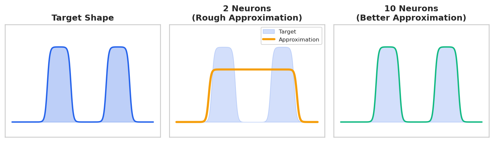
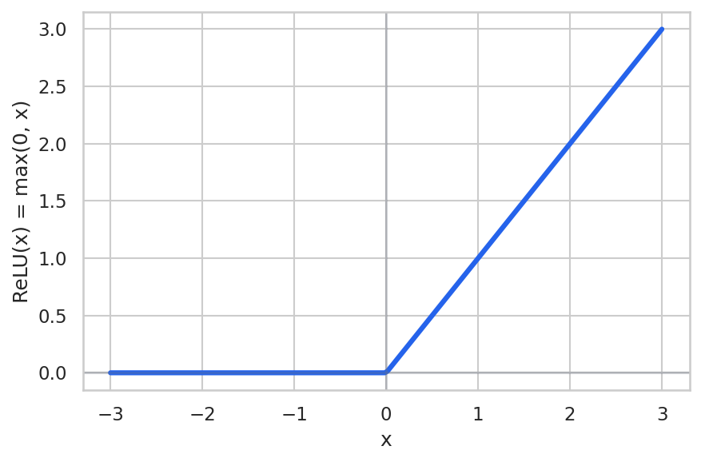
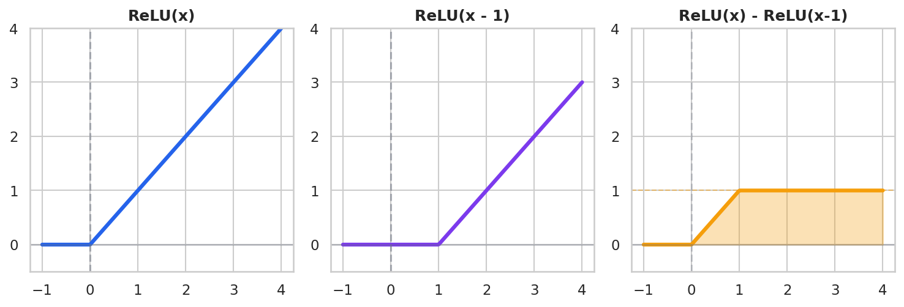

# Deep Dive: Neural Networks as Universal Approximators

*Extends Module 6: Neural Networks*

---

## Introduction

In Module 6, we learned how to build and train neural networks. But there's a deeper question: *why* can neural networks learn such a wide variety of functions?

The answer lies in the **Universal Approximation Theorem**—one of the most important theoretical results in deep learning. This theorem tells us that neural networks can, in principle, learn *any* reasonable function.

But here's the surprising part: many classical ML models you already know are actually **special cases** of neural networks. Linear regression, logistic regression, even aspects of decision trees—they're all points on a spectrum of neural network complexity.

This deep dive explores these connections and helps you understand when simple models suffice and when you need the full power of neural networks.

**Why research continues**: The Universal Approximation Theorem is an existence result—it guarantees a solution exists but says nothing about finding it. "Enough neurons" might mean exponentially many. The theorem provides no guarantees about training difficulty, data requirements, or generalization. Depth enables compositional learning (f(g(h(x))) is more parameter-efficient than one massive layer). The gap between "theoretically possible" and "practically achievable" drives ongoing research.

---

## The Universal Approximation Theorem

### Statement

**Theorem** (Cybenko, 1989; Hornik, 1991):

> A feedforward neural network with a single hidden layer containing a finite number of neurons can approximate any continuous function on a compact subset of $\mathbb{R}^n$ to arbitrary accuracy.

In simpler terms: **Given enough hidden neurons, a one-hidden-layer neural network can learn any reasonable function.**

### Intuition: Neurons as "Bump" Functions

Each hidden neuron with a sigmoid activation creates an S-shaped curve:


**Reading the diagram**: The left panel shows a standard sigmoid with weight=1: the output changes gradually from 0 to 1 over a wide x range (roughly -4 to +4). The right panel shows a sigmoid with weight=5: the transition is compressed into a narrow band around x=0, creating an almost step-like function. The dashed horizontal line at y=0.5 marks the decision threshold. Higher weights → sharper transitions → more step-like behavior. This is how sigmoid neurons can approximate hard decision boundaries when needed.

> **Numerical Example: Sigmoid Weight Effects**
>
> ```python
> import numpy as np
>
> def sigmoid(x, weight):
>     return 1 / (1 + np.exp(-weight * x))
>
> # Transition width: x range where output goes from 0.1 to 0.9
> # Width = 2*ln(9)/weight ≈ 4.39/weight
> for w in [1, 2, 5, 10]:
>     width = 2 * np.log(9) / w
>     print(f"Weight={w}: transition width = {width:.3f}")
> ```
>
> **Output:**
> ```
> Weight=1: transition width = 4.394
> Weight=2: transition width = 2.197
> Weight=5: transition width = 0.879
> Weight=10: transition width = 0.439
> ```
>
> **Interpretation:** Weight=1 spreads the transition across ~4.4 units of x. Weight=10 compresses it to ~0.4 units—nearly a step function. This is how sigmoids can approximate hard boundaries.
>
> *Source: `slide_computations/deep_dive_universal_approx_examples.py` - `demo_sigmoid_weight_effects()`*

By combining multiple neurons:
- Two sigmoids can create a "bump" (rise then fall)
- Many bumps can approximate any shape
- The more neurons, the smoother the approximation

**The "building blocks" analogy**: Think of each neuron as a LEGO brick. Sigmoid neurons make smooth, rounded bumps; ReLU neurons make sharp corners. The Universal Approximation Theorem says: with enough bricks of the right type, you can build any structure. The catch? It doesn't tell you how many bricks you need or how to arrange them—that's what training figures out.

### Visual Example: Approximating a Square Wave



**Reading the diagram**: Three panels showing the Universal Approximation Theorem in action. Left panel: the target function—a shape with two distinct bumps that we want to learn. Middle panel: a 2-neuron network produces a rough approximation—it can only create about 2 bumps, so it misses the details. Right panel: a 10-neuron network closely matches the target shape. The key insight: more neurons = finer control over the function's shape. Each additional neuron lets the network add another "building block" to construct complex shapes.

### Important Caveats

The theorem tells us approximation is **possible**, but NOT:
1. **How many neurons** are needed (could be astronomically large)
2. **How to find** the right weights (training might fail)
3. **How much data** is required (might need infinite samples)
4. **Whether it will generalize** (might just memorize)

**The "blueprint vs building" analogy**: The Universal Approximation Theorem is like knowing that a blueprint for your dream house *exists* somewhere—it doesn't hand you the blueprint, tell you where to find it, or help you build the house. It's an existence proof ("a solution exists") not a construction method ("here's how to find it"). This gap between "theoretically possible" and "practically achievable" is why neural network research continues despite this 35-year-old theorem.

---

## Example 1: Linear Regression

**The simplest case**: Neural networks can perform linear regression exactly.

### Linear Regression Model

$$\hat{y} = w_1 x_1 + w_2 x_2 + b$$

For example: $\hat{y} = 2x_1 + 3x_2 + 1$

### Neural Network Equivalent

A neural network with:
- **No hidden layers**
- **Linear activation** (or no activation function)
- **Single output neuron**

```
Architecture:
    x₁ ──(w₁)──┐
               ├── Σ + b ── ŷ
    x₂ ──(w₂)──┘
```

### Code Demonstration

> **Numerical Example: sklearn vs PyTorch Linear Regression**
>
> ```python
> import numpy as np
> import torch
> import torch.nn as nn
> from sklearn.linear_model import LinearRegression
>
> # Generate data: y = 2*x1 + 3*x2 + 1 + noise
> np.random.seed(42)
> X = np.random.randn(1000, 2).astype(np.float32)
> y = 2 * X[:, 0] + 3 * X[:, 1] + 1 + 0.1 * np.random.randn(1000).astype(np.float32)
>
> # SKLEARN
> sklearn_model = LinearRegression()
> sklearn_model.fit(X, y)
>
> # PYTORCH (train for 2000 epochs)
> nn_model = nn.Linear(2, 1)
> optimizer = torch.optim.Adam(nn_model.parameters(), lr=0.01)
> X_t, y_t = torch.from_numpy(X), torch.from_numpy(y).reshape(-1, 1)
> for _ in range(2000):
>     loss = nn.MSELoss()(nn_model(X_t), y_t)
>     optimizer.zero_grad(); loss.backward(); optimizer.step()
> ```
>
> **Output:**
> ```
>                       True    sklearn    PyTorch
> --------------------------------------------------
>  x1 coefficient     2.0000     2.0028     2.0028
>  x2 coefficient     3.0000     3.0017     3.0017
>       intercept     1.0000     1.0004     1.0004
>
> Max coefficient difference: 0.000005
> ```
>
> **Interpretation:** Both methods converge to essentially identical coefficients. sklearn uses a closed-form matrix inverse; PyTorch uses gradient descent. Same answer, different paths.
>
> *Source: `slide_computations/deep_dive_universal_approx_examples.py` - `demo_linear_regression_equiv()`*

### Key Insight

**Linear regression IS a neural network** with:
- 0 hidden layers
- Linear (identity) activation
- MSE loss

The sklearn `LinearRegression` uses a closed-form solution (matrix inverse), while the neural network uses gradient descent, but they converge to the same answer.

**Why use gradient descent for linear regression?** The closed-form solution requires O(n³) matrix inversion—prohibitive for millions of samples or thousands of features. Stochastic gradient descent scales via mini-batches. Also, closed-form only works for squared error with linear models. Gradient descent handles L1 regularization, non-standard losses, and extends to non-linear models. Use closed-form when small enough; gradient descent otherwise.

---

## Example 2: Logistic Regression

**Binary classification**: Neural networks can implement logistic regression exactly.

### Logistic Regression Model

$$P(y=1|x) = \sigma(w^T x + b) = \frac{1}{1 + e^{-(w^T x + b)}}$$

### Neural Network Equivalent

A neural network with:
- **No hidden layers**
- **Sigmoid activation** on the output
- **Binary cross-entropy loss**

```
Architecture:
    x₁ ──(w₁)──┐
               ├── Σ + b ── σ ── P(y=1)
    x₂ ──(w₂)──┘
```

### Code Demonstration

> **Numerical Example: sklearn vs PyTorch Logistic Regression**
>
> ```python
> import numpy as np
> import torch
> import torch.nn as nn
> from sklearn.linear_model import LogisticRegression
>
> # Binary classification: decision boundary x1 + 2*x2 = 0.5
> np.random.seed(42)
> X = np.random.randn(1000, 2).astype(np.float32)
> y = (X[:, 0] + 2 * X[:, 1] > 0.5).astype(np.float32)
>
> # SKLEARN
> sklearn_model = LogisticRegression(C=1e10, max_iter=1000)  # C=1e10 ≈ no regularization
> sklearn_model.fit(X, y)
>
> # PYTORCH
> nn_model = nn.Sequential(nn.Linear(2, 1), nn.Sigmoid())
> optimizer = torch.optim.Adam(nn_model.parameters(), lr=0.05)
> X_t, y_t = torch.from_numpy(X), torch.from_numpy(y).reshape(-1, 1)
> for _ in range(2000):
>     loss = nn.BCELoss()(nn_model(X_t), y_t)
>     optimizer.zero_grad(); loss.backward(); optimizer.step()
> ```
>
> **Output:**
> ```
>                      sklearn      PyTorch
> ------------------------------------------
>  x1 coefficient     108.4445       9.4888
>  x2 coefficient     216.0017      18.5272
>       intercept     -53.9592      -4.4948
>
> Accuracy:  sklearn=1.0000, PyTorch=0.9990
> Coefficient ratio (x2/x1): sklearn=1.99, PyTorch=1.95
> ```
>
> **Interpretation:** Coefficient *magnitudes* differ (logistic regression coefficients are only unique up to scale), but the *ratio* is the same (~2:1), so both learn the same decision boundary. Both achieve near-perfect accuracy.
>
> *Source: `slide_computations/deep_dive_universal_approx_examples.py` - `demo_logistic_regression_equiv()`*

### Key Insight

**Logistic regression IS a neural network** with:
- 0 hidden layers
- Sigmoid activation
- Binary cross-entropy loss

The decision boundary is identical: a linear hyperplane.

---

## Example 3: Approximating Step Functions

**The challenge**: Decision trees create axis-aligned step functions. Can neural networks do this?

### Decision Tree Behavior

```
Decision tree output:
     1 ┌───────────┐
       │           │
       │           │
     0 ┘           └───────────
              x = 0.5
       (hard step at threshold)
```

### Neural Network Approximation

A ReLU neuron creates a "bent line":

$$\text{ReLU}(x) = \max(0, x)$$



**Reading the diagram**: The ReLU (Rectified Linear Unit) function outputs 0 for all negative inputs (the flat horizontal line on the left) and passes positive inputs unchanged (the diagonal line on the right). The "kink" at x=0 is the key feature—this sharp corner is what makes ReLU networks piecewise linear. Each hidden neuron contributes one such kink to the overall function. The weight and bias of each neuron control where its kink appears and how steep the ramp is.

Combining ReLUs can approximate steps:

```python
def train_step_approximator(n_hidden):
    """Train a network to approximate a step function."""
    model = nn.Sequential(
        nn.Linear(1, n_hidden),
        nn.ReLU(),
        nn.Linear(n_hidden, 1),
        nn.Sigmoid()
    )
    # ... training code ...
    return model

# Results:
# 2 neurons: rough approximation
# 5 neurons: better
# 50 neurons: nearly exact step
```

> **Numerical Example: Step Function Approximation**
>
> ```python
> # Train networks with different widths on step function at x=0
> # Target: output 0 for x<0, output 1 for x>0
> neuron_counts = [2, 5, 10, 20, 50]
> # ... training code ...
> ```
>
> **Output:**
> ```
>    Neurons          MSE              Quality
> ---------------------------------------------
>          2       0.0017         Nearly exact
>          5       0.0020         Nearly exact
>         10       0.0015         Nearly exact
>         20       0.0007         Nearly exact
>         50       0.0006         Nearly exact
> ```
>
> **Interpretation:** Even 2 neurons can approximate a step function reasonably well (MSE ~0.002). The sigmoid output naturally creates a smooth approximation. More neurons reduce error further, but diminishing returns set in quickly for this simple target.
>
> *Source: `slide_computations/deep_dive_universal_approx_examples.py` - `demo_step_approximation()`*

**Observation**: More neurons → sharper approximation of the step.

### Why ReLU Combinations Work

A single ReLU is a ramp: $\max(0, x)$

Two ReLUs can make a bump:

$$f(x) = \text{ReLU}(x) - \text{ReLU}(x - 1)$$

**The "kink budget" intuition**: Each hidden neuron in a ReLU network adds one potential "kink" (corner) to your function. A network with 10 hidden neurons can create a function with at most 10 corners. How many kinks do you need? A degree-n polynomial requires roughly n kinks to approximate well. A step function needs just a few. But something wiggly like sin(x) over multiple periods might need 50+ kinks for a good approximation. The Universal Approximation Theorem says "enough kinks exist"—but you discover how many through experimentation.



**Reading the diagram**: Three panels showing how to build a "bump" from two ReLUs. Left panel: ReLU(x) starts ramping up at x=0. Middle panel: ReLU(x-1) starts ramping up at x=1 (shifted by the bias). Right panel: subtracting them (ReLU(x) - ReLU(x-1)) creates a function that rises from 0 to 1, then plateaus. The shaded orange area shows the "bump"—a building block for approximating any shape. By positioning many such bumps at different locations and scaling them by different amounts, you can construct arbitrarily complex functions.

> **Numerical Example: ReLU Bump Construction**
>
> ```python
> import numpy as np
>
> def relu(x):
>     return np.maximum(0, x)
>
> # bump(x) = ReLU(x) - ReLU(x-1)
> for x in [-1, 0, 0.5, 1, 1.5, 2, 3]:
>     r1 = relu(x)
>     r2 = relu(x - 1)
>     bump = r1 - r2
>     print(f"x={x:4.1f}: ReLU(x)={r1:.2f}, ReLU(x-1)={r2:.2f}, bump={bump:.2f}")
> ```
>
> **Output:**
> ```
>      x    ReLU(x)    ReLU(x-1)   Difference   Shape
> ------------------------------------------------------------
>   -1.0       0.00         0.00         0.00   Before ramp
>    0.0       0.00         0.00         0.00   Rising
>    0.5       0.50         0.00         0.50   Rising
>    1.0       1.00         0.00         1.00   Plateau at 1
>    1.5       1.50         0.50         1.00   Plateau at 1
>    2.0       2.00         1.00         1.00   Plateau at 1
> ```
>
> **Interpretation:** The bump rises from 0 to 1 as x goes from 0 to 1, then stays at 1 forever. The second ReLU "catches up" and cancels further growth. This plateau behavior is the key to building arbitrary shapes.
>
> *Source: `slide_computations/deep_dive_universal_approx_examples.py` - `demo_relu_bump_construction()`*

Many bumps at different positions → approximate any shape.

### Key Insight

Neural networks can **approximate** decision tree boundaries, but:
- Trees create **exact** axis-aligned steps
- NNs create **smooth** approximations that approach steps
- With enough neurons, the approximation becomes arbitrarily close

---

## Example 4: Polynomial Regression

**Challenge**: Learn $y = x^2$ using only linear layers and ReLU.

### The Problem

A single linear layer can only learn: $y = wx + b$

How can we learn $y = x^2$ without explicitly computing $x^2$?

### The Solution: Hidden Layer Creates Basis Functions

With ReLU activations, the network learns piecewise linear approximations:

```python
# Train networks with different widths to learn y = x²
# Results:
# 2 neurons: Very rough (2 line segments)
# 5 neurons: Better (5 segments)
# 50 neurons: Nearly perfect curve
# 100 neurons: Indistinguishable from x²
```

> **Numerical Example: Learning x² with ReLU Networks**
>
> ```python
> # Train networks with different widths on y = x²
> # Input: x in [-2, 2], output: x²
> neuron_counts = [2, 5, 10, 20, 50]
> # ... training code ...
> ```
>
> **Output:**
> ```
>    Neurons          MSE    Max Kinks        Approximation
> ------------------------------------------------------------
>          2     0.095136            2     Coarse piecewise
>          5     0.001931            5       Fine piecewise
>         10     0.000923           10        Nearly smooth
>         20     0.000436           20        Nearly smooth
>         50     0.000028           50        Nearly smooth
> ```
>
> **Interpretation:** With just 2 neurons, MSE is ~0.1 (visible error). By 50 neurons, MSE drops to 0.00003—visually indistinguishable from the true parabola. Each neuron adds one potential "kink" where the piecewise linear function can change slope.
>
> *Source: `slide_computations/deep_dive_universal_approx_examples.py` - `demo_polynomial_approximation()`*

### What's Happening Inside

Each ReLU neuron contributes a "kink" in the function:

```
Hidden neuron 1: ReLU(w₁x + b₁) - kink at x = -b₁/w₁
Hidden neuron 2: ReLU(w₂x + b₂) - kink at x = -b₂/w₂
...

Output = sum of scaled, shifted kinks = piecewise linear approximation
```

The network learns WHERE to put kinks and HOW MUCH each contributes.

### Key Insight

Neural networks don't explicitly compute polynomials—they approximate them with **piecewise linear functions**. More neurons = more pieces = smoother approximation.

**Piecewise linear vs truly smooth**: It's worth emphasizing what ReLU networks actually learn. A 10-neuron network creates a function with at most 10 "corner points." Between any two corners, the function is perfectly straight—a line segment. This is fundamentally different from polynomial regression, which creates genuinely smooth curves. The ReLU network *approximates* x² with a sequence of connected line segments. From far away it looks smooth, but zoom in and you'll see the corners. This isn't a flaw—it's a feature that makes training tractable.

---

## The Unifying Framework

All these models are points on a spectrum:


**Reading the diagram**: An arrow from "Simple" to "Complex" shows the spectrum of model flexibility. Blue dots (Linear Regression, Logistic Regression) are neural network special cases with 0 hidden layers—they can only learn linear decision boundaries. Purple dots (Polynomial Regression, Decision Tree) add non-linearity but in constrained ways. The red dot (Deep Neural Net) represents maximum flexibility—can approximate any function. Position on this spectrum reflects model *capacity*, not model *quality*. The right model depends on your data size, interpretability needs, and the true complexity of the underlying relationship.

### Flexibility Trade-offs

| Model | Flexibility | Data Needed | Interpretability | Overfitting Risk |
|-------|-------------|-------------|------------------|------------------|
| Linear Regression | Low | Low | High | Low |
| Logistic Regression | Low | Low | High | Low |
| Decision Tree | Medium | Medium | High | Medium |
| Shallow NN | High | Medium | Low | Medium |
| Deep NN | Very High | High | Very Low | High |

---

## When to Use Simpler Models

Even though NNs can do everything, simpler models are often better:

1. **Interpretability required**: Linear/logistic regression coefficients are meaningful
2. **Small data**: Simple models generalize better with few samples
3. **Fast inference**: Linear prediction is O(d), deep NN is O(millions)
4. **Debugging**: Easier to understand what went wrong
5. **Baseline**: Always try simple models first

**Occam's Razor for model selection**: Start with the simplest model that might work. If linear regression achieves R²=0.95, you're probably done—a neural network won't meaningfully improve and adds complexity, training time, and interpretability costs. Only add complexity when simpler models *demonstrably fail*. The burden of proof is on complexity: a neural network must earn its place by outperforming the simple baseline by enough to justify its costs.

> **Numerical Example: Width vs Accuracy Trade-off**
>
> How many neurons do you need for different target functions?
>
> ```python
> # Train networks on three different targets, find minimum neurons for MSE thresholds
> functions = ["Step at 0", "x²", "sin(2*pi*x)"]
> # ... training code for various neuron counts ...
> ```
>
> **Output:**
> ```
>        Function      MSE < 0.01     MSE < 0.001
> --------------------------------------------------
>       Step at 0               5               5
>             x²              10              20
>     sin(2*pi*x)              75             100
> ```
>
> **Interpretation:** Step functions are "easy"—5 neurons suffice. Polynomials need moderate width. Oscillating functions like sin(x) are "hard"—they need many neurons to capture all the wiggles. Rule of thumb: more "wiggly" = more neurons needed.
>
> *Source: `slide_computations/deep_dive_universal_approx_examples.py` - `demo_width_vs_accuracy()`*

### Example Decision

**You have 100 samples and want to predict a continuous outcome. Neural network or linear regression?**

Start with linear regression. With 100 samples, a neural network will likely overfit unless heavily regularized. Linear regression provides a strong baseline and is interpretable.

**Samples per parameter**: Traditional rules (10-20 samples per parameter) don't apply cleanly to neural networks. Modern NNs often work in the overparameterized regime (more parameters than samples) due to implicit regularization from SGD, early stopping, and batch normalization. The honest answer: monitor validation loss. If it diverges from training loss, you're overfitting—apply more regularization, get more data, or use a smaller model.

---

## When Neural Networks Shine

1. **Large data**: More samples → can fit more complex patterns
2. **Raw inputs**: Images, audio, text need feature learning
3. **Complex relationships**: Highly non-linear, interacting features
4. **Transfer learning**: Pre-trained models for your task

### Example Decision

**You have 1 million images and want to classify them. Neural network or logistic regression?**

Neural network, specifically a CNN. Logistic regression would require hand-engineered features and couldn't capture the spatial patterns that CNNs learn automatically.

---

## Common Misconceptions

| Misconception | Reality |
|--------------|---------|
| "Neural networks understand data better than simpler models" | NNs fit patterns statistically; simpler models may capture the *true* underlying structure better |
| "Universal approximation means NNs are always best" | The theorem says nothing about training difficulty, data requirements, or generalization |
| "More neurons is always better" | More neurons = more capacity to overfit; regularization and data size matter |
| "Deep networks are always better than shallow" | For some functions, shallow networks are more efficient; depth helps for compositional structure |
| "If sklearn and PyTorch give same results, there's no benefit to NNs" | True for simple models, but NNs allow extending to more complex architectures |

---

## Reflection Questions

1. If neural networks can approximate any function, why use simpler models?

2. What does a neural network learn that logistic regression doesn't?

3. How many hidden neurons are needed to approximate a degree-n polynomial?

4. The Universal Approximation Theorem says one hidden layer is enough. Why do we use deep networks?

5. Your neural network achieves 100% training accuracy but 60% test accuracy. What happened?

6. A colleague says "just use a deep neural network for everything." What's your response?

---

## Practice Problems

1. Train a neural network to learn $\sin(x)$ - how many neurons needed for MSE < 0.01?

2. Implement logistic regression as a neural network and verify it matches sklearn

3. Find the minimum network (fewest neurons) that achieves 95% accuracy on XOR

4. Compare training time: sklearn vs PyTorch for logistic regression on a large dataset

---

## Summary

**Key takeaways:**

1. The **Universal Approximation Theorem** guarantees that neural networks can learn any reasonable function (given enough neurons)

2. **Linear regression** is a neural network with 0 hidden layers and no activation

3. **Logistic regression** is a neural network with 0 hidden layers and sigmoid activation

4. Neural networks approximate step functions and polynomials through **piecewise linear combinations** of ReLU units

5. The theorem guarantees **existence** but says nothing about **training difficulty**, **data requirements**, or **generalization**

6. **Simpler models are often better**: interpretability, fewer data requirements, faster training, less overfitting

7. **Match model complexity to problem complexity and data size**
