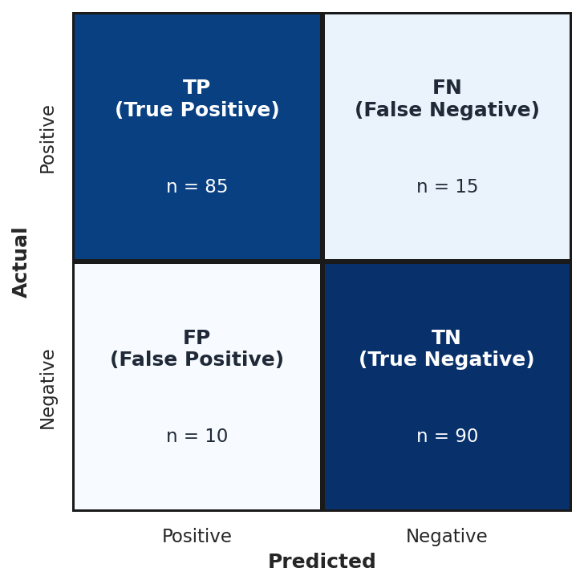

# Module 1: Foundations of Machine Learning

## Introduction

This foundational module establishes everything you'll use throughout the course. The vocabulary, the concepts, the data preparation skills, the evaluation methodology—all of it forms the bedrock of your machine learning practice.

By the end of this module, you'll have a conceptual framework for understanding what machine learning actually is, how to prepare data for it, and critically, how to know whether your models are actually working. That last part—evaluation—is where most business ML projects go wrong, so we'll spend significant time there.

Evaluation failures typically stem from three categories: **data leakage** (test set information inadvertently influences training), **metric mismatch** (optimizing for the wrong measure), and **insufficient validation rigor** (relying on a single train/test split). Teams focus on building models without equal rigor on proving they work—evaluation methodology should receive as much scrutiny as model architecture.

---

## Learning Objectives

By the end of this module, you should be able to:

1. **Differentiate** between AI, Machine Learning, Data Science, and related fields
2. **Classify** business problems into appropriate ML task categories (supervised, unsupervised, reinforcement)
3. **Construct** data preparation pipelines that prevent data leakage
4. **Select** appropriate evaluation metrics based on business context
5. **Diagnose** overfitting and underfitting using the bias-variance framework

---

## 1.1 Introduction & Historical Context

### The AI/ML/Data Science Landscape

Understanding how these concepts relate to each other matters because these terms are thrown around loosely in industry, and you need to cut through the hype.


At the outermost level, we have **Computer Science**—the study of computation, information, and automation. More precisely, computer science is concerned with the theory, design, and application of algorithms: step-by-step procedures for solving problems and processing information.

Within that sits **Artificial Intelligence**—machines that exhibit intelligent behavior. The term was coined in 1956, but the foundations go back further—Alan Turing's 1950 paper "Computing Machinery and Intelligence" proposed the Turing test: can a machine's responses be indistinguishable from a human's? AI is a broad umbrella that includes rule-based systems, expert systems, and machine learning.

Inside AI, we have **Machine Learning**—systems that learn from data without being explicitly programmed. This is our focus for the course. The key distinction is *learning from data*. Instead of a human writing rules, the system discovers patterns from examples.

And inside ML, we have **Deep Learning**—machine learning using neural networks with many layers. Deep learning has driven most of the recent AI breakthroughs, but it's just one approach within ML.

**Data Science** sits alongside and overlaps with all of these. Data Science is about extracting insights from data—it combines statistics, domain expertise, and programming. A data scientist might use ML, or might use traditional statistical methods, or might just create visualizations. It's about the goal (insights from data), not the method.

In practice, these boundaries are fuzzy and a single project often spans multiple domains. A customer churn project might involve data science (exploratory analysis), machine learning (predictive model), and software engineering (deployment). The skills transfer across domains: wrangling data, building models, evaluating rigorously, and communicating effectively.

### Key Definitions

| Term | Definition |
|------|------------|
| **Artificial Intelligence** | Machines that exhibit intelligence (broad umbrella) |
| **Machine Learning** | Systems that learn from data without being explicitly programmed |
| **Deep Learning** | ML using neural networks with many layers |
| **Data Science** | Extracting insights from data (may or may not use ML) |

**Important nuance**: These terms are used loosely in industry. Job postings for "AI Engineer" and "ML Engineer" and "Data Scientist" often describe the same role. Help yourself by understanding what people actually mean, not just what they say. When evaluating roles, look at specific tools (SQL, Python, TensorFlow), deliverables (reports, dashboards, deployed models), and team structure rather than job titles.

### Historical Timeline

Understanding where ML came from helps you understand why it works the way it does—and why we've seen cycles of hype and disappointment.

#### Early Years

| Year | Milestone | Significance |
|------|-----------|--------------|
| 1847 | Gradient descent published (Cauchy) | The optimization algorithm that powers nearly all modern ML |
| 1950 | Turing Test proposed | Defined the question "Can machines think?" |
| 1957 | Perceptron invented | First neural network, sparked initial optimism |
| 1969 | Minsky & Papert's "Perceptrons" | Showed limitations, contributed to AI Winter |
| 1980s | Expert Systems boom | Rule-based AI, eventually hit scalability limits |
| 1984 | CART published | Foundation for all tree-based methods |
| 1986 | Backpropagation popularized | Enabled training multi-layer networks |
| 1997 | Deep Blue beats Kasparov | Specialized AI success, but not learning |

#### Modern Era

| Year | Milestone | Significance |
|------|-----------|--------------|
| 2001 | Random Forests published | Go-to algorithm for tabular data |
| 2006 | Deep learning revival; CUDA released | New training techniques and GPU computing |
| 2012 | AlexNet wins ImageNet | Deep learning breakthrough, GPU training |
| 2014 | XGBoost released | Dominates Kaggle, still state-of-the-art for tabular data |
| 2016 | AlphaGo beats Lee Sedol | Reinforcement learning milestone |
| 2017 | "Attention Is All You Need" | Transformer architecture, foundation for GPT/BERT |
| 2018 | BERT released | Transfer learning comes to NLP |
| 2020 | GPT-3 | Scaling produces emergent capabilities |
| 2022 | ChatGPT released | Large language models go mainstream |

AI Winters were caused by overpromising followed by underdelivering—researchers making bold claims to secure funding, then hitting fundamental limitations. The lesson is to be realistic about what current technology can and cannot do.

**The key insight for business**: Most AI projects fail due to poor problem definition, not technical limitations. Getting the problem right matters more than getting the algorithm right. Poor problem definition manifests as vague objectives ("use AI to improve customer experience"), wrong target variables (predicting email responses when the business needs conversions), or misaligned success metrics (optimizing call duration when customer satisfaction is the goal). Before writing any code, get crystal clear on: What exactly are we predicting? How will predictions be used? What decisions will change?

### ML Task Categories


Machine Learning branches into three main categories:

**Supervised Learning**: You have labeled data, and you want to predict labels for new data. The "supervision" comes from the labels—they tell the algorithm what the right answer is.
- **Regression**: Predicting continuous values (numbers)
  - Examples: Sales forecasting, price prediction, demand estimation
- **Classification**: Predicting categories (discrete labels)
  - Examples: Spam detection, customer churn, fraud detection

**Unsupervised Learning**: No labels. You're trying to find hidden structure in the data.
- **Clustering**: Grouping similar items together
  - Examples: Customer segmentation, document grouping, anomaly detection
- **Dimensionality Reduction**: Compressing many features into fewer features
  - Examples: Visualization, noise reduction, feature extraction

**Reinforcement Learning**: The algorithm learns optimal actions through trial and error, receiving rewards or penalties for its choices.
- Examples: Game playing, robotics, recommendation systems
- Brief overview only—not a focus of this course

The choice between regression and classification depends on what decision the prediction enables. If the business needs a specific number ("How many units will we sell?"), that's regression. If it needs a category ("Will this customer churn?"), that's classification. Many problems could be framed either way—a common pattern is to build a regression model (predict probability) and threshold it for classification decisions, giving you both continuous scores for prioritization and discrete classes for action.

### Business Applications by Industry

| Industry | Application | ML Type |
|----------|-------------|---------|
| Retail | Demand forecasting | Regression |
| Finance | Fraud detection | Classification |
| Marketing | Customer segmentation | Clustering |
| Healthcare | Disease diagnosis | Classification |
| Manufacturing | Predictive maintenance | Classification |
| E-commerce | Product recommendations | Various |

Classification appears frequently in business because we often need to make decisions: approve or deny, flag or pass, target or ignore. Pedagogically, we learn regression first because it's simpler—you can visualize a line through points, and the loss function (MSE) is intuitive. Many core concepts (features, coefficients, overfitting, regularization) work identically in both settings, so learning them in the simpler regression context means you can focus on concepts rather than classification-specific complications.

### Common Misconceptions

| Misconception | Reality |
|--------------|---------|
| "AI and ML are the same thing" | ML is a subset of AI. AI includes rule-based systems that don't learn from data. |
| "ML will replace all human decision-making" | ML augments human decisions. Many problems require human judgment, ethics, and contextual understanding. |
| "Deep Learning is always better than traditional ML" | Deep learning requires lots of data and compute. For tabular business data, traditional ML (XGBoost, Random Forest) often wins. |
| "More data always leads to better models" | Data quality matters more than quantity. Biased or noisy data leads to biased or noisy models. |

**How much data is "enough"?** For classical ML, a common rule of thumb is 10-30 samples per feature for linear models. For deep learning, you typically need thousands to millions of samples, though transfer learning reduces this. The practical test: plot learning curves. If validation performance is still improving as you add data, you need more. If it's plateaued, more data won't help—you need better features or a different model.

---

## 1.2 Data Preparation & Feature Engineering

### The Golden Rule: Garbage In, Garbage Out

Data preparation often takes 80% of project time but determines success or failure. This isn't glamorous work, but it's where projects succeed or fail.

> "The algorithm is not the hard part. Getting the data right is the hard part."

Your job as a business analytics professional is often more about data preparation than algorithm selection. The algorithm is almost a commodity at this point—scikit-learn gives you excellent implementations of everything. What matters is what you feed it.

Since algorithms are implemented for us, focus on higher-leverage skills: **problem framing** (translating vague business requests into well-defined ML problems), **data intuition** (recognizing quality issues and predictive features), **evaluation rigor** (proper validation setup), **communication** (explaining results to stakeholders), and **debugging** (diagnosing whether issues are data quality, feature engineering, or methodology). Libraries implement algorithms; they don't tell you which algorithm to use or whether your features make sense.

### Common Data Quality Issues

1. **Missing values**: NaN, null, empty strings, placeholder values (-999, "N/A")
2. **Duplicates**: Exact duplicates or near-duplicates
3. **Outliers**: Extreme values (errors vs. legitimate rare events)
4. **Inconsistent formatting**: "USA" vs "United States" vs "US"
5. **Data entry errors**: Typos, wrong units, swapped fields

### Initial Data Exploration

Before you do anything else, explore your data:

```python
import polars as pl

df.shape              # How big is this? (rows, columns)
df.schema             # What are the data types?
df.null_count()       # Where are the missing values?
df.describe()         # Basic statistics
df.is_duplicated().sum()  # Any duplicate rows?
```

Always explore before modeling. Don't jump straight into building models without checking basic things like "are there missing values?"

A reasonable heuristic is to spend 10-20% of your total project time on EDA before modeling. You've explored "enough" when you can answer: What are the data types and ranges? Where are missing values and what causes them? Are there obvious outliers? What is the target distribution? Which features correlate with the target? The goal is to catch major issues—I've seen projects waste weeks on sophisticated modeling only to discover the target was incorrectly defined. A few hours of EDA would have saved that time.

### Handling Missing Data

**Strategy 1: Deletion**
- Drop rows with any missing values
- Simple, but you lose information and might introduce bias
- When to use: Missing completely at random, small percentage missing

**Strategy 2: Imputation**
- **Mean/Median/Mode**: Simple, but ignores relationships between variables
- **Forward/Backward fill**: For time series—use the previous or next value
- **Model-based (k-NN)**: Predict the missing value from other features

```python
from sklearn.impute import SimpleImputer, KNNImputer

# Simple imputation
imputer = SimpleImputer(strategy='median')
X_imputed = imputer.fit_transform(X)

# K-NN imputation (considers relationships)
knn_imputer = KNNImputer(n_neighbors=5)
X_imputed = knn_imputer.fit_transform(X)
```

### Why Data is Missing Matters

The reason data is missing determines what you should do about it:

| Type | Description | Implication |
|------|-------------|-------------|
| **MCAR** (Missing Completely at Random) | Missingness has nothing to do with any values | Safe to delete |
| **MAR** (Missing at Random) | Missingness is related to other observed variables | Imputation can work |
| **MNAR** (Missing Not at Random) | Missingness is related to the missing value itself | Problematic—missingness is informative |

Example: If high-income people don't report their income, that's MNAR—you can't fully recover the missing information because it's biased.

Diagnosing missingness type requires evidence and domain knowledge. For MCAR, compare distributions of other variables between rows with and without missing values—they should be similar if missingness is random. For MAR vs MNAR, build a model predicting whether a value is missing using other features; if it has predictive power, missingness is at least partially MAR. Domain knowledge is essential: ask why data might be missing and whether that reason relates to the missing value itself.

### Feature Scaling

Many algorithms are sensitive to the scale of features. If one feature ranges from 0-1 and another from 0-1,000,000, the larger feature will dominate.

**Algorithms that need scaling**:
- Linear regression, SVM, k-NN, neural networks
- Regularized methods (regularization only penalizes fairly when features are scaled)

**Standardization (Z-score)**:

$$x_{scaled} = \frac{x - \mu}{\sigma}$$

- Centers at 0, standard deviation of 1
- Preserves outliers
- Use when: Algorithm assumes normally distributed data

**Min-Max Normalization**:

$$x_{scaled} = \frac{x - x_{min}}{x_{max} - x_{min}}$$

- Scales to [0, 1] range
- Sensitive to outliers
- Use when: Need bounded range (neural networks)

```python
from sklearn.preprocessing import StandardScaler, MinMaxScaler

# Standardization
scaler = StandardScaler()
X_train_scaled = scaler.fit_transform(X_train)
X_test_scaled = scaler.transform(X_test)  # Use training parameters!

# Min-Max
minmax = MinMaxScaler()
X_train_scaled = minmax.fit_transform(X_train)
```

**When NOT to scale**: Tree-based methods (Decision Trees, Random Forest, XGBoost) are scale-invariant! They make splits based on thresholds, not distances. Don't waste time scaling for tree-based models.

If you're unsure which algorithm you'll use, wait until you've chosen one, or incorporate scaling into your pipeline so it's applied conditionally. Different algorithms prefer different scaling (neural networks work better with MinMax [0,1], while SVMs use standardization). The practical solution is sklearn Pipelines—create a pipeline where scaling is a step before the model, which also prevents data leakage during cross-validation.

### Outlier Detection

Methods for different data distributions:

**For normally distributed data:**
- **Z-score method**: Points more than 3 standard deviations from the mean are outliers

**For non-normal or unknown distributions:**
- **IQR method**: Outliers are below Q1 - 1.5×IQR or above Q3 + 1.5×IQR (what box plots use)
- **Modified Z-score**: Uses median and MAD instead of mean and std—very robust
- **Isolation Forest**: Tree-based method that works well in high dimensions

```python
from sklearn.ensemble import IsolationForest
clf = IsolationForest(contamination=0.05)  # Expect ~5% outliers
outliers = clf.fit_predict(X)  # Returns -1 for outliers
```

**What to do with outliers**: Investigate first! Are they data errors? Legitimate extreme values? Different populations? Options include: remove, cap/winsorize, transform (log), or use robust methods.

**Critical distinction**: Outliers in features vs. outliers as targets are completely different problems. If you're detecting fraud, fraudulent transactions ARE what you're trying to predict—they're your positive class, not outliers to remove. Never remove outliers blindly based on statistics alone. Investigate: are they errors, rare-but-legitimate events, or the signal you're looking for? For anomaly detection tasks, use algorithms designed to find outliers (Isolation Forest, One-Class SVM), don't remove them.

### Encoding Categorical Variables

ML algorithms need numbers, not strings. When you have categorical variables, you need to convert them.

**One-Hot Encoding**:
- Creates binary column for each category
- Use for: Nominal categories (no order), small number of categories
- Watch out: High cardinality (many categories) creates many columns

**Label Encoding**:
- Assigns integer to each category
- Use for: Ordinal categories (low/medium/high)
- Watch out: Implies ordering where none exists

**Target Encoding**:
- Replace category with mean of target variable for that category
- Use for: High cardinality categories (ZIP codes, product SKUs)
- Watch out: Data leakage! Must use cross-validation

Target encoding causes leakage because when you calculate the mean target value for a category, you're using information from rows you'll later predict—each row's outcome influences its own encoded feature value. The severity scales with category size (worse for rare categories). The solution is cross-validation-style encoding: for each row, calculate the category mean using only OTHER rows. Libraries like `category_encoders` implement this properly.

```python
from sklearn.preprocessing import OneHotEncoder, LabelEncoder

# One-hot encoding
encoder = OneHotEncoder(sparse=False, handle_unknown='ignore')
X_encoded = encoder.fit_transform(X[['category_column']])

# With polars (simpler for exploration)
X_encoded = df.to_dummies(columns=['category_column'])
```

### The Cardinal Rule: Preventing Data Leakage

> **Never let information from the test set influence training!**

This is called **data leakage**, and it will give you overly optimistic results that don't hold up in production.

**Common leakage examples:**
1. **Scaling before splitting**: Scaler sees test data statistics
2. **Feature selection on all data**: Test data influences feature choice
3. **Target encoding without proper CV**: Test data target values leak
4. **Time series: future predicts past**: Future information used for past predictions

**The correct workflow:**

```
1. Split data FIRST
   └─→ Training set | Test set

2. Fit preprocessing on TRAINING only
   └─→ scaler.fit_transform(X_train)

3. Transform test using training parameters
   └─→ scaler.transform(X_test)
```

**Handling extrapolation** (test data with values outside training range): For standardization, values get z-scores beyond the training range—most models handle this gracefully. For MinMax scaling, values might exceed [0,1], consider clipping. For one-hot encoding, new categories are problematic—set `handle_unknown='ignore'` to assign zeros. Check whether training data covers the expected production range and monitor for out-of-distribution inputs.

```python
from sklearn.model_selection import train_test_split
from sklearn.preprocessing import StandardScaler

# Step 1: Split FIRST
X_train, X_test, y_train, y_test = train_test_split(
    X, y, test_size=0.2, random_state=42
)

# Step 2: Fit on training ONLY
scaler = StandardScaler()
X_train_scaled = scaler.fit_transform(X_train)

# Step 3: Transform test using training parameters
X_test_scaled = scaler.transform(X_test)  # NOT fit_transform!
```

**Understanding fit, transform, and fit_transform:**

| Method | What it does | When to use |
|--------|--------------|-------------|
| `fit()` | Learns parameters from data (e.g., mean, std) | When you only need to learn, not transform |
| `transform()` | Applies learned parameters to transform data | On test data (using parameters learned from train) |
| `fit_transform()` | Does both in one step | On training data (learn + transform together) |

### Common Misconceptions

| Misconception | Reality |
|--------------|---------|
| "More features always improve models" | Too many features can cause overfitting. Feature selection is often necessary. |
| "Just drop all rows with missing values" | This can introduce bias and waste data. Imputation is often better. |
| "Always standardize your features" | Tree-based models don't need scaling. Know your algorithm! |
| "One-hot encoding is always best" | High-cardinality features may need target encoding or embeddings. |

**Embeddings** (covered in detail in Module 6) are learned dense vector representations for high-cardinality categories. Instead of one-hot encoding (millions of columns for product IDs) or target encoding (loses information), each category gets a small vector of continuous values learned during training. The model figures out which categories are "similar" based on their relationship to the target.

---

## 1.3 Model Evaluation & Validation

### Why Evaluation Matters

How do we know if a model is actually good? This seems straightforward, but it's actually subtle:
- Good on *what metric*? Different metrics capture different aspects of performance.
- Good compared to *what baseline*? 85% accuracy might be great or terrible depending on context.
- Will it work on *new, unseen data*? Performance on training data is meaningless if it doesn't generalize.

Always compare to a **meaningful baseline**: for regression, predict the mean (any positive R² beats this); for classification, predict the majority class (90% accuracy from always predicting the majority in a 90/10 dataset). In time series, "predict yesterday's value" is a common baseline. If your model doesn't substantially beat these simple baselines, either the problem is harder than expected or something is wrong with your setup.

### Regression Metrics

**Mean Squared Error (MSE)**:

$$MSE = \frac{1}{n}\sum_{i=1}^{n}(y_i - \hat{y}_i)^2$$

- Penalizes large errors heavily (squared)
- Units are squared (hard to interpret)

**Root Mean Squared Error (RMSE)**:

$$RMSE = \sqrt{MSE}$$

- Same units as target variable (interpretable)
- Most common regression metric
- "On average, our predictions are off by $X"

**Mean Absolute Error (MAE)**:

$$MAE = \frac{1}{n}\sum_{i=1}^{n}|y_i - \hat{y}_i|$$

- Less sensitive to outliers than RMSE
- Linear penalty

**R² (Coefficient of Determination)**:

$$R^2 = 1 - \frac{\sum(y_i - \hat{y}_i)^2}{\sum(y_i - \bar{y})^2}$$

- Proportion of variance explained
- 1 = perfect, 0 = no better than mean prediction
- Can be negative if model is worse than mean!

**Mean Absolute Percentage Error (MAPE)**:

$$MAPE = \frac{100\%}{n}\sum_{i=1}^{n}\left|\frac{y_i - \hat{y}_i}{y_i}\right|$$

- Scale-independent (percentage)
- Easy for stakeholders: "predictions are off by 5% on average"
- Undefined when y = 0

**Which to use?**

| Metric | Use When |
|--------|----------|
| RMSE | Default choice, care about large errors |
| MAE | Outliers in target, want robustness |
| R² | Comparing models, explaining to stakeholders |
| MAPE | Need percentage interpretation, values not near zero |

**For stakeholders**, translate metrics to business language: RMSE becomes "predictions are off by $15,000 on average"; MAPE becomes "predictions are typically within 5%"; R² becomes "our model captures 75% of the predictive signal." Best practice: connect to business outcomes—"we'll avoid $200K in overstock costs annually." Stakeholders care about business impact, not statistical properties.

### Classification Metrics

Everything starts with the **confusion matrix**:



- **TP (True Positive)**: Predicted positive, actually positive. Correct.
- **TN (True Negative)**: Predicted negative, actually negative. Correct.
- **FP (False Positive)**: Predicted positive, actually negative. False alarm. Type I error.
- **FN (False Negative)**: Predicted negative, actually positive. Missed it. Type II error.

**Accuracy**:

$$Accuracy = \frac{TP + TN}{TP + TN + FP + FN}$$

- Proportion of correct predictions
- **Misleading with imbalanced classes!** A model predicting "not fraud" for everything gets 99% accuracy if 99% of transactions are legitimate—but it catches zero fraud.

**Precision**:

$$Precision = \frac{TP}{TP + FP}$$

- "Of those we predicted positive, how many were actually positive?"
- High precision = few false alarms

**Recall (Sensitivity)**:

$$Recall = \frac{TP}{TP + FN}$$

- "Of actual positives, how many did we catch?"
- High recall = few missed positives

**F1 Score**:

$$F1 = 2 \times \frac{Precision \times Recall}{Precision + Recall}$$

- Harmonic mean of precision and recall
- Use when you need to balance both

The harmonic mean penalizes extreme imbalances more than the arithmetic mean. With precision=0.99 and recall=0.01, the arithmetic mean is 0.50 (suggesting "medium" performance), but F1 is just 0.02—correctly reflecting the model is nearly useless. A model can't compensate for terrible recall with great precision; F1 remains low. If you care more about one metric (e.g., recall for medical diagnosis), optimize that directly.

**AUC-ROC**:
- Area Under the ROC Curve
- Measures ranking ability across all thresholds
- 0.5 = random, 1.0 = perfect

The ROC curve plots True Positive Rate vs. False Positive Rate at different classification thresholds. The diagonal line represents random guessing; a perfect model hugs the top-left corner. AUC=0.8 means if you randomly pick one positive and one negative example, there's an 80% chance the model scores the positive higher—independent of the threshold you'll use in production.

```python
from sklearn.metrics import (
    accuracy_score, precision_score, recall_score,
    f1_score, roc_auc_score, confusion_matrix,
    classification_report
)

# All-in-one report
print(classification_report(y_test, y_pred))
```

### Cross-Validation

A single train/test split can be lucky or unlucky. Cross-validation gives us:
- More reliable performance estimate
- Confidence interval (mean ± standard deviation)
- Uses all data for both training and validation

**K-Fold Cross-Validation**:


1. Split data into K folds
2. Train on K-1 folds, validate on remaining fold
3. Repeat K times, each fold as validation once
4. Average the results

**Stratified K-Fold**: Essential for imbalanced data—maintains class distribution in each fold. Without stratification, regular K-Fold can create folds with very different class distributions, causing unreliable estimates (high variance CV scores) and training on unrealistic distributions. Use `StratifiedKFold` by default for classification—it never hurts.

**Time Series Split**: Respects temporal ordering—train on past, validate on future. Shuffling time series creates **temporal leakage**—using future information to predict the past, which is impossible in production. Models can report 90% accuracy with shuffled validation and 55% with proper temporal validation. Use `TimeSeriesSplit` to mimic production conditions.

```python
from sklearn.model_selection import (
    cross_val_score, KFold, StratifiedKFold, TimeSeriesSplit
)

# Basic K-Fold
scores = cross_val_score(model, X, y, cv=5, scoring='accuracy')
print(f"Mean: {scores.mean():.3f} (+/- {scores.std():.3f})")

# Stratified for classification
cv = StratifiedKFold(n_splits=5, shuffle=True, random_state=42)
scores = cross_val_score(model, X, y, cv=cv)

# Time series
tscv = TimeSeriesSplit(n_splits=5)
scores = cross_val_score(model, X, y, cv=tscv)
```

### Overfitting vs Underfitting


**Underfitting (High Bias)**:
- Training error HIGH, Test error HIGH
- Model too simple to capture patterns
- Solutions: More features, more complex model, less regularization

**Overfitting (High Variance)**:
- Training error LOW, Test error HIGH
- Model memorizes training data including noise
- Solutions: More data, simpler model, regularization, early stopping

**Diagnostic pattern**: Look at the gap between training and test error. Both high = underfitting. Training low but test high = overfitting.

If both training and test error are low, that's the goal—but it doesn't guarantee perfection. Still check for: data leakage (too good to be true?), non-representative test sets, wrong metrics (high accuracy but terrible minority class performance), or overfitting to the test set from repeated model selection. Monitor performance after deployment for concept drift.

### The Bias-Variance Tradeoff

**Total Error = Bias² + Variance + Irreducible Noise**

**Bias** is systematic error—the model's tendency to miss patterns. High bias means underfitting. A linear model trying to fit a curved relationship has high bias.

**Variance** is sensitivity to training data—how much the model changes with different training samples. High variance means overfitting. A very deep decision tree has high variance.

**The tradeoff**: Reducing bias usually increases variance (more complex model). Reducing variance usually increases bias (simpler model). The goal is to find the sweet spot.

There are ways to reduce both simultaneously: **more data** lets you fit complex models without overfitting; **ensemble methods** like Random Forests reduce variance while boosting reduces bias; **better features** make patterns easier to learn. Irreducible noise sets a floor on total error, and at any given data size there is still a tradeoff—these techniques shift the curve inward but don't eliminate it.

**The Dart-Throwing Analogy**:

| Scenario | Bias | Variance | Pattern |
|----------|------|----------|---------|
| High bias, low variance | Off-center | Clustered together | Consistent but wrong |
| Low bias, high variance | Centered on average | Scattered everywhere | Right on average but inconsistent |
| **Ideal** | **Centered** | **Clustered** | **Accurate and precise** |

### Business-Specific Evaluation

**Not all errors cost the same!**

| Domain | False Positive Cost | False Negative Cost |
|--------|---------------------|---------------------|
| Spam filter | Important email missed | Spam in inbox |
| Medical diagnosis | Unnecessary treatment | Missed disease |
| Fraud detection | Investigation cost | Fraud loss |
| Manufacturing QC | Discarding good product | Shipping defect |

For spam, a false positive (real email marked as spam) is much worse than a false negative. Optimize for precision.

For medical diagnosis, a false negative (missed disease) is much worse. Optimize for recall.

**Choose metrics that reflect business costs.** Accuracy is misleading because it treats all errors as equal when they rarely are.

To quantify costs, work backwards from business outcomes: (1) identify the action taken for each prediction (predicted churn → retention offer), (2) quantify costs for each outcome (false positive blocks a $200 customer, false negative lets $500 fraud through), (3) build a cost matrix multiplying confusion matrix cells by costs, (4) optimize threshold for minimum total cost. Start with rough estimates, get stakeholder buy-in, and refine over time—approximate cost quantification beats implicitly assuming all errors cost the same.

### Common Misconceptions

| Misconception | Reality |
|--------------|---------|
| "Higher R² always means better model" | Can overfit to get high R². Test set R² is what matters. R² can be negative! |
| "Accuracy is the best metric for classification" | Misleading for imbalanced classes. Use precision/recall/F1/AUC instead. |
| "More complex models are always better" | Complexity increases variance. Simpler models often generalize better. |
| "Cross-validation eliminates the need for a test set" | CV estimates performance but you should still have a final holdout test set. |

---

## 1.4 Python Ecosystem Setup

### Jupyter Notebooks and Google Colab

**Jupyter Notebooks**:
- Interactive computing environment
- Mix code, output, and documentation
- Great for exploration and teaching

**Google Colab advantages**:
- No setup required
- Free GPU access
- Easy sharing
- Pre-installed packages

**Best practices**:
- Use markdown cells for documentation
- Keep cells focused (one logical step per cell)
- Restart and run all before sharing
- Use consistent naming conventions

"Restart and Run All" prevents hidden state issues: cells run out of order, deleted cells leaving ghost variables, or imports removed but modules still loaded. If it fails, your notebook has hidden dependencies. If it succeeds, anyone can reproduce your results. Do this before every commit or share.

### marimo Notebooks

**marimo** is a next-generation Python notebook that solves many of Jupyter's pain points. Unlike Jupyter's manual cell execution, marimo notebooks are **reactive**—when you change a variable, all cells that depend on it automatically re-execute. This eliminates the hidden state problems that plague Jupyter notebooks.

**Key differences from Jupyter:**

| Feature | Jupyter | marimo |
|---------|---------|--------|
| Execution | Manual cell runs | Reactive (auto-updates) |
| File format | JSON (.ipynb) | Pure Python (.py) |
| Reproducibility | State can diverge from code | Always reproducible |
| Version control | Difficult diffs | Clean git diffs |
| Cell ordering | Can run out of order | Execution order enforced |

**When to use each:**
- **Jupyter/Colab**: Quick exploration, collaboration with non-technical stakeholders, free GPU access (Colab)
- **marimo**: Production notebooks, version control, reproducibility, teaching environments where you want guaranteed consistency

In this course, we use marimo for most notebooks because the reactive execution model prevents the "run cells out of order" bugs that commonly confuse students. The pure Python format also means you can use standard development tools like linters and formatters.

### pixi Package Manager

**pixi** is a modern package manager that handles Python environments with speed and reproducibility. It uses the same package repository as conda but with faster dependency resolution and a cleaner project structure.

**Why pixi for this course?**
- **Fast**: Resolves dependencies in seconds, not minutes
- **Reproducible**: Lock files ensure everyone has identical environments
- **Cross-platform**: Same configuration works on Windows, Mac, and Linux
- **Simple**: One configuration file (`pixi.toml`) defines your entire project

**Installation:**

```bash
# macOS/Linux
curl -fsSL https://pixi.sh/install.sh | bash

# Windows (PowerShell)
iwr -useb https://pixi.sh/install.ps1 | iex
```

After installation, restart your terminal and verify with `pixi --version`.

**Project structure:**

A pixi project is defined by a `pixi.toml` file:

```toml
[project]
name = "ban501-module1"
version = "0.1.0"
channels = ["conda-forge"]
platforms = ["linux-64", "osx-arm64", "win-64"]

[dependencies]
python = ">=3.11"
polars = ">=1.0"
scikit-learn = ">=1.5"
matplotlib = ">=3.8"
seaborn = ">=0.13"
marimo = ">=0.9"
```

**Common commands:**

| Command | Description |
|---------|-------------|
| `pixi install` | Install all dependencies from pixi.toml |
| `pixi add polars` | Add a new dependency |
| `pixi run python script.py` | Run Python in the project environment |
| `pixi run marimo edit notebook.py` | Open marimo notebook in project environment |
| `pixi shell` | Activate the environment in your shell |

**Typical workflow:**

```bash
# Clone or create a project
cd my-project

# Install dependencies (creates/updates lock file)
pixi install

# Run your code
pixi run python analysis.py

# Or activate the environment for interactive work
pixi shell
python
```

### polars Essentials

Core operations you need to know:

```python
import polars as pl
import numpy as np

# Reading data
df = pl.read_csv('data.csv')

# Basic exploration
df.head()           # First 5 rows
df.schema           # Data types (column name -> dtype mapping)
df.describe()       # Statistical summary
df.shape            # (rows, columns)

# Selection
df.select('column')              # Single column
df.select(['col1', 'col2'])      # Multiple columns
df.row(0)                        # Single row by index
df[0:5]                          # Slice rows

# Filtering
df.filter(pl.col('age') > 30)
df.filter((pl.col('age') > 30) & (pl.col('income') > 50000))

# Aggregation
df.group_by('category').agg(pl.all().mean())
df.group_by('category').agg([
    pl.col('sales').sum(),
    pl.col('customers').count()
])

# Handling missing values
df.null_count()                    # Count nulls per column
df.drop_nulls()                    # Drop rows with any nulls
df.fill_null(0)                    # Fill with constant
df.fill_null(strategy='mean')      # Fill with mean
```

### Basic EDA Workflow

**Standard exploration sequence**:

1. **Load and inspect**: Shape, dtypes, head/tail. Check for obvious issues.
2. **Missing values**: Count per column, visualize missingness patterns.
3. **Univariate analysis**: Distributions of each feature, identify outliers.
4. **Bivariate analysis**: Correlations, feature vs. target relationships.
5. **Document findings**: Key insights, data quality issues, feature engineering ideas.

Write EDA documentation for your future self six months from now—you'll have forgotten everything. Minimum viable documentation: what questions were you answering? What did you find? What decisions did you make based on findings? What concerns remain? Document conclusions and decisions, not every chart. For formal projects, a separate EDA report for stakeholders should tell a story; the working notebook is for reproducibility.

### Visualization with matplotlib/seaborn

```python
import matplotlib.pyplot as plt
import seaborn as sns

# Distribution
plt.figure(figsize=(10, 6))
sns.histplot(df['column'], kde=True)
plt.title('Distribution of Column')
plt.show()

# Correlation heatmap
plt.figure(figsize=(12, 8))
sns.heatmap(df.corr(), annot=True, cmap='coolwarm', center=0)
plt.title('Correlation Matrix')
plt.show()

# Scatter plot with hue
sns.scatterplot(data=df, x='feature1', y='feature2', hue='target')

# Box plot for outliers
sns.boxplot(data=df, x='category', y='value')

# Pair plot (for small number of features)
sns.pairplot(df, hue='target')
```

**Visualization principles**:
- Always label axes
- Use appropriate chart types
- Consider colorblind-friendly palettes
- Don't clutter—one message per chart

### GPU Computing and CUDA

In Section 1.1, we mentioned that NVIDIA released CUDA in 2006 and that AlexNet's 2012 ImageNet victory was enabled by GPU training. Understanding why GPUs matter for machine learning is essential context for the deep learning modules later in this course.

**Why GPUs matter for ML:**

CPUs (Central Processing Units) are designed for sequential tasks—they have a few powerful cores that excel at complex operations one at a time. GPUs (Graphics Processing Units) take the opposite approach: thousands of simpler cores that perform many calculations simultaneously.

Neural network training involves the same operation (multiply-accumulate) applied to millions of numbers. A CPU processes these one at a time; a GPU processes thousands in parallel. This is why training that takes weeks on a CPU can finish in hours on a GPU.

**CUDA and the deep learning revolution:**

CUDA (Compute Unified Device Architecture) is NVIDIA's programming interface that lets general software—not just graphics—run on GPUs. Before CUDA, using GPUs for non-graphics tasks required awkward workarounds. CUDA made GPU computing accessible to researchers, and deep learning took off.

The 2012 AlexNet breakthrough wasn't just about a better algorithm—the same architecture trained on CPUs would have taken months. GPU training made rapid experimentation possible, accelerating the entire field.

**Practical considerations:**

| Task | Hardware Recommendation |
|------|------------------------|
| Tabular data (small-medium datasets) | CPU sufficient |
| Traditional ML (Random Forest, XGBoost) | CPU sufficient |
| Deep learning training | GPU recommended |
| Large-scale inference | GPU beneficial |
| Image/video processing | GPU recommended |

For the early modules of this course (regression, classification, ensemble methods), you won't need GPU access—these algorithms run well on CPUs. When we reach the neural network modules (6-8), GPU access becomes valuable.

**Accessing GPUs:**

- **Google Colab**: Free tier includes limited GPU access—select "Runtime > Change runtime type > GPU"
- **Local GPU**: Requires an NVIDIA GPU and CUDA toolkit installation
- **Cloud platforms**: AWS, GCP, and Azure offer GPU instances for rent

For this course, Colab's free tier is sufficient for the deep learning exercises. If you have a local NVIDIA GPU, you can configure pixi to use CUDA-enabled packages, but this is optional.

---

## Reflection Questions

1. A company says they're using "AI" for their chatbot. Is this AI? Machine Learning? Both? Neither? How would you find out?

2. You have a dataset where 30% of income values are missing. The missingness correlates with age (older people less likely to report). What imputation strategy would you use?

3. A colleague scales the entire dataset before splitting into train/test. Why is this a problem? How would it affect your model evaluation?

4. Your manager asks: "Is 85% accuracy good?" How would you respond?

5. A model has R² = 0.95 on training data and R² = 0.60 on test data. What's happening? What would you do?

6. Which metric would you optimize for a medical diagnosis model where missing a disease (false negative) is much worse than a false alarm?

---

## Practice Problems

1. Given a dataset description, identify whether each column needs scaling, encoding, or neither.

2. Calculate precision, recall, and F1 from a confusion matrix.

3. Interpret R² = 0.75 in business terms.

4. Identify potential data leakage in a described ML pipeline.

5. For each business problem, recommend an appropriate evaluation metric and justify:
   - Predicting next month's revenue
   - Identifying customers likely to cancel
   - Grouping products that are often bought together

---

## Chapter Summary

**Six key takeaways from Module 1:**

1. **ML learns patterns from data**—it's a subset of AI, and it overlaps with Data Science. Don't conflate these terms.

2. **Match problem to task type**—regression for continuous values, classification for categories, clustering for grouping.

3. **Data prep is critical**—handle missing values, scale features (when appropriate), encode categoricals. This is 80% of the work.

4. **Prevent data leakage**—split first, fit on train, transform test. This is the cardinal rule.

5. **Evaluate appropriately**—choose metrics that reflect business costs. Accuracy is often the wrong choice.

6. **Diagnose model issues**—use the bias-variance framework. High test error + low train error = overfitting.

---

## What's Next

In Module 2, we'll dive into **Regression Methods**:
- Linear regression fundamentals
- Regularization (Lasso, Ridge)
- Polynomial features
- Model interpretation

You'll apply everything from Module 1:
- Data preparation pipelines
- Train-test splits
- RMSE, MAE, R² evaluation
- Cross-validation

The concepts we've established in this module are the foundation. Module 2 starts building on that foundation.
