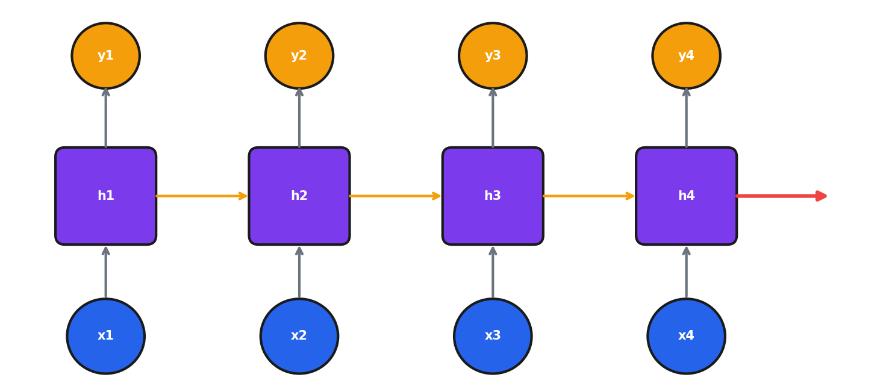

# Module 8: Natural Language Processing

## Introduction

Today we tackle natural language processing—teaching machines to understand and generate text.

Text is everywhere in business: customer reviews, support tickets, emails, social media, contracts, reports. Being able to automatically classify, extract information from, and generate text is incredibly valuable.

In Module 7, we saw how CNNs revolutionized image processing. Today, we'll see how transformers revolutionized NLP. The transformer architecture—introduced in 2017—is the foundation for BERT, GPT, and essentially every language model you've heard of.

By the end of this module, you'll understand how text becomes numbers, why transformers work so well, and how to leverage pre-trained models for your own applications.

**What is machine "understanding"?** Machines don't understand text like humans—they operate on statistical representations where similar meanings cluster together. What we call "understanding" is sophisticated pattern matching: a model that predicts masked words correctly has learned syntax, semantics, and world knowledge encoded as neural network weights. Whether this constitutes "understanding" or merely simulates it remains philosophically contested.

---

## Learning Objectives

By the end of this module, you should be able to:

1. **Explain** different text representation methods (BoW, TF-IDF, embeddings)
2. **Understand** why word order and context matter in NLP
3. **Describe** RNN architecture and the vanishing gradient problem
4. **Explain** the transformer architecture and self-attention mechanism
5. **Apply** pre-trained language models (BERT, GPT) for NLP tasks
6. **Identify** appropriate NLP approaches for business problems

---

## 8.1 Text Representation

### The Challenge of Text

Text is fundamentally different from tabular data:
- **Variable length**: Sentences can be 5 words or 500
- **Order matters**: "Dog bites man" ≠ "Man bites dog"
- **Same word, different meanings**: "bank" (river) vs "bank" (financial)
- **Vast vocabulary**: Hundreds of thousands of words

**Goal**: Convert text to numerical vectors that capture meaning.

### Bag of Words (BoW)

The simplest approach: count word occurrences.

| Document | "love" | "machine" | "learning" |
|----------|--------|-----------|------------|
| "I love machine learning" | 1 | 1 | 1 |
| "Machine learning is great" | 0 | 1 | 1 |

Each document becomes a vector of word counts.

```python
from sklearn.feature_extraction.text import CountVectorizer

corpus = [
    "I love machine learning",
    "Machine learning is great",
    "I love deep learning"
]

vectorizer = CountVectorizer()
X = vectorizer.fit_transform(corpus)
print(vectorizer.get_feature_names_out())
# ['deep', 'great', 'is', 'learning', 'love', 'machine']
```

**Limitations:**
- Ignores word order: "dog bites man" = "man bites dog"
- Sparse and high-dimensional
- No semantic similarity: "good" and "great" are unrelated

### TF-IDF

**Improvement**: Weight words by importance.

$$\text{TF-IDF} = \text{TF}(t,d) \times \log\frac{N}{\text{DF}(t)}$$

- **TF** (Term Frequency): How often the word appears in this document
- **IDF** (Inverse Document Frequency): How rare the word is across all documents

Common words like "the" and "is" → low weight
Distinctive words → high weight

**Why the log in IDF?**

1. **Dampening effect**: Without log, a word appearing in 1 vs 1,000 documents would have a 1,000x difference. Log compresses this to about 3x.

2. **Prevents domination**: Extremely rare words would otherwise overwhelm everything else.

Think of it: the difference between appearing in 1 vs 10 documents is more meaningful than 10,000 vs 10,010. The log captures this diminishing-returns intuition.

```python
from sklearn.feature_extraction.text import TfidfVectorizer

tfidf = TfidfVectorizer()
X = tfidf.fit_transform(corpus)
```

### Word Embeddings

**The breakthrough**: Learn dense vectors where similar words are close.

**Word2Vec (2013)**: Train a neural network on word prediction.
- **Skip-gram**: Given a word, predict its context words
- **CBOW**: Given context words, predict the target word
- Result: 100-300 dimensional vectors per word

**The key insight**: The embedding layer weights ARE the word vectors. Words appearing in similar contexts get similar embeddings.

**Famous example:**

$$king - man + woman \approx queen$$

```python
from gensim.models import Word2Vec

model = Word2Vec(sentences, vector_size=100, window=5, min_count=1)
model.wv.most_similar(positive=['king', 'woman'], negative=['man'])
```

This works because the embedding captures semantic relationships! "King" and "queen" differ in the same way that "man" and "woman" differ.

**How Word2Vec learns relationships**: Word2Vec never sees labeled examples of gender or royalty—these emerge from the distributional hypothesis (words in similar contexts have similar meanings). The model sees "king" near "throne," "crown," "ruled"; so does "queen." To minimize prediction error, the embedding must encode that "king → queen" is the same direction as "man → woman." This emergent structure falls out naturally from simple prediction tasks on large corpora.

### Why Context Matters

Word embeddings are powerful, but they miss context:

**Word order:**
- "Nick ate the pizza" vs "The pizza ate Nick"
- Same words, completely different meaning

**Negation:**
- "The movie was good" vs "The movie was not good"
- BoW and simple embeddings can't distinguish these

**Reference:**
- "The dog didn't cross the road because *it* was tired"
- "The dog didn't cross the road because *it* was wide"
- What does "it" refer to? Depends on context!

**Key insight**: We need models that understand sequences and context.

### Common Misconceptions

| Misconception | Reality |
|--------------|---------|
| "Word embeddings understand meaning" | Embeddings capture statistical patterns, not true understanding |
| "Pre-trained embeddings work for any domain" | Domain-specific training often helps (medical, legal) |
| "More dimensions = better embeddings" | Diminishing returns; 100-300 usually sufficient |

---

## 8.2 Recurrent Neural Networks

### RNN Architecture

**Problem**: Standard neural networks can't handle variable-length sequences or remember previous inputs.

**Solution**: Process sequences one element at a time, maintaining memory.

$$h_t = \tanh(W_{xh}x_t + W_{hh}h_{t-1} + b)$$



The **hidden state** $h$ carries information through time.

**Why tanh?**
1. **Output range [-1, 1]**: Can represent "opposite" concepts
2. **Zero-centered**: Helps gradients flow in both directions
3. **Stronger gradients**: Maximum gradient is 1 (vs 0.25 for sigmoid)
4. **Bounded**: Prevents hidden states from exploding

### The Vanishing Gradient Problem

**The challenge**: Gradients shrink exponentially through timesteps.

If you're processing a 100-word sentence, gradients from word 100 need to flow back to word 1. But multiplied through 100 steps, they become tiny.

**Result**: The RNN "forgets" early parts of long sequences.

### LSTM: Long Short-Term Memory

**Solution**: Gated architecture with explicit memory.

**Three gates:**
1. **Forget gate**: What to remove from memory
2. **Input gate**: What new information to add
3. **Output gate**: What to output

**Cell state**: A highway for information to flow unchanged through time.

The gates learn when to keep information and when to forget it.

```python
lstm = nn.LSTM(
    input_size=100,
    hidden_size=256,
    num_layers=2,
    batch_first=True,
    bidirectional=True
)
```

**Connection to attention**: LSTM gates pioneered the idea of selective information access. Attention generalizes this—instead of a single memory cell, attention lets the model look back at any previous position.

### GRU: Gated Recurrent Unit

**Simplified LSTM** with fewer parameters.

**Two gates:**
1. **Reset gate**: How much past to forget
2. **Update gate**: How much to update the hidden state

Often performs similarly to LSTM but trains faster.

### RNN Limitations

1. **Sequential processing**: Can't parallelize—each step depends on the previous
2. **Long-range dependencies**: Still struggle with very long sequences
3. **Fixed representation**: A single hidden vector must capture everything

**These limitations motivated transformers.**

**Why RNNs dominated before transformers**: They were the best available option. Before RNNs: n-gram models (limited context, exponential parameters) and HMMs (restrictive assumptions). LSTMs/GRUs mitigated vanishing gradients; attention mechanisms (2014-2015) addressed the fixed-representation bottleneck. The 2017 transformer paper showed attention alone was sufficient, but required significant innovations (positional encoding, Q/K/V formulation) plus computational resources. Progress looks obvious in retrospect.

---

## 8.3 Transformers

### "Attention Is All You Need" (2017)

This paper changed everything.

**The key insight**: Replace recurrence with attention.

**Benefits:**
- **Parallel processing**: Process all tokens simultaneously
- **Direct connections**: Any position can attend to any other
- **Better long-range dependencies**: No vanishing gradient through 100 steps

### Self-Attention

**Core idea**: Each word looks at all other words to understand context.

**Query, Key, Value:**
- **Query (Q)**: What am I looking for?
- **Key (K)**: What do I contain?
- **Value (V)**: What information do I provide?

$$\text{Attention}(Q, K, V) = \text{softmax}\left(\frac{QK^T}{\sqrt{d_k}}\right)V$$

**Intuition:**
1. Compute similarity between query and all keys
2. Normalize with softmax → attention weights
3. Weighted sum of values

**Example**: "The cat sat on the mat because **it** was tired"

When processing "it":
- Compute similarity with all words
- "it" should attend most strongly to "cat"
- Copy information from "cat" to understand what "it" refers to

**How attention learns coreference**: Entirely through training—nothing programmed in. "It was tired" makes sense if "it" attends to "cat" (animals get tired), not "mat." The Q/K/V projection matrices adjust so "it" and "cat" have high dot product. Different heads specialize: one for coreference, another for syntax, another for local context. The model discovers these patterns; engineers didn't program them.

### Why Scale by √d_k?

Dot products grow with dimension. If d_k is large, dot products can be very large, pushing softmax into saturation (all attention on one token). Scaling keeps variance roughly constant.

### Multi-Head Attention

**Why multiple heads?** Different heads can attend to different things.

- One head might focus on syntax (subject-verb agreement)
- Another might focus on semantics (what "it" refers to)
- Another might focus on nearby context

```python
multihead_attn = nn.MultiheadAttention(
    embed_dim=512,
    num_heads=8
)
```

Eight heads, each with 64 dimensions, capturing different relationships.

### Positional Encoding

**Problem**: Attention is permutation-invariant. It doesn't know word order!

**Solution**: Add position information to embeddings.

$$PE_{pos,2i} = \sin(pos / 10000^{2i/d})$$

$$PE_{pos,2i+1} = \cos(pos / 10000^{2i/d})$$

Where:
- $pos$ = position in sequence (0, 1, 2, ...)
- $d$ = embedding dimension
- $i$ = dimension index, ranging from 0 to $d/2 - 1$

Different frequencies let the model learn to attend to relative positions.

### Encoder vs Decoder

**Encoder (BERT-style):**
- Processes entire sequence at once
- Bidirectional context (see past and future)
- Good for understanding and classification

**Decoder (GPT-style):**
- Generates sequence left-to-right
- Causal masking (can only see past)
- Good for text generation

**Encoder-Decoder (T5):**
- Encoder processes input
- Decoder generates output
- Good for translation, summarization

### Common Misconceptions

| Misconception | Reality |
|--------------|---------|
| "Transformers understand language" | They learn statistical patterns, not true understanding |
| "Attention = interpretability" | Attention weights don't always align with human intuition |
| "Bigger models are always better" | Diminishing returns; efficiency matters |

---

## 8.4 Foundation Models

### Pre-training → Fine-tuning

**Pre-training**: Train on massive text (expensive!)
- Billions of words
- Millions of dollars in compute
- Done once by big labs

**Fine-tuning**: Adapt to your task (cheap!)
- Your data + pre-trained model
- Hours, not weeks

**Zero-shot**: Use directly with prompts
- No training needed
- Just ask the model

### BERT

**Bidirectional Encoder Representations from Transformers**

**Pre-training:**
- Masked Language Modeling: Predict masked words from context
- Next Sentence Prediction: Does sentence B follow sentence A?

**Use cases:**
- Text classification
- Named entity recognition
- Question answering
- Semantic similarity

```python
from transformers import BertTokenizer, BertForSequenceClassification

tokenizer = BertTokenizer.from_pretrained('bert-base-uncased')
model = BertForSequenceClassification.from_pretrained(
    'bert-base-uncased',
    num_labels=2
)

inputs = tokenizer(
    "This movie was great!",
    return_tensors="pt",
    padding=True,
    truncation=True
)
outputs = model(**inputs)
```

### GPT Family

**Generative Pre-trained Transformer**

**Architecture**: Decoder-only (autoregressive)

**Capabilities:**
- Text generation
- Zero/few-shot learning
- Instruction following (ChatGPT)

**Scale evolution:**
- GPT (2018): 117M parameters
- GPT-2 (2019): 1.5B parameters
- GPT-3 (2020): 175B parameters
- GPT-4 (2023): Multimodal, even larger

### BERT vs GPT

| Aspect | BERT | GPT |
|--------|------|-----|
| Architecture | Encoder | Decoder |
| Context | Bidirectional | Left-to-right |
| Best for | Understanding | Generation |
| Training | Masked LM | Next token prediction |

**When to use which?**

Use BERT for classification, NER, and understanding tasks—especially with labeled training data.

Use GPT for generation tasks, or when you want to leverage prompting without training data.

**Why fine-tune BERT vs. zero-shot GPT?** (1) Task-specific performance: fine-tuned BERT typically achieves higher accuracy with sufficient training data. (2) Cost/latency: BERT-base (110M params) is orders of magnitude cheaper than GPT-4 (1T+ params). (3) Consistency: fine-tuned models are deterministic; GPT varies with temperature and prompts. (4) Domain adaptation and data privacy (local training vs. API calls). Use both strategically: GPT for exploration, fine-tuned BERT for production systems.

### Business Applications

| Application | Model | Example |
|-------------|-------|---------|
| Sentiment Analysis | BERT | Product reviews |
| Chatbot | GPT | Customer support |
| Classification | BERT | Email routing |
| Named Entity Recognition | BERT | Extract entities |
| Text Generation | GPT | Marketing copy |
| Summarization | T5, BART | Meeting notes |

---

## 8.5 Beyond Text

### Vision Transformers (ViT)

- Split images into patches
- Treat patches as "tokens"
- Apply transformer encoder
- State-of-the-art on many vision benchmarks

### Audio Processing

- **Whisper**: Speech recognition
- **wav2vec**: Audio embeddings

### Multimodal Models

- **CLIP**: Connect images and text
- **DALL-E**: Generate images from text
- **GPT-4V**: Vision + language

**Key insight**: Transformer architecture is general-purpose, not just for text.

---

## Reflection Questions

1. Why does 'king - man + woman ≈ queen' work with word embeddings?

2. A BoW model can't tell 'dog bites man' from 'man bites dog'. Why not? What's needed to fix this?

3. You're building a document search engine. Would you use BoW, TF-IDF, or embeddings? Why?

4. Why can't a standard feedforward network process variable-length text?

5. An LSTM processes a 100-word sentence. How does information from word 1 reach the output?

6. Why is self-attention more parallelizable than RNNs?

7. In "The animal didn't cross the road because it was tired", what should 'it' attend to?

8. Why does BERT use bidirectional attention while GPT uses causal attention?

9. When would you fine-tune BERT vs use GPT with prompting?

---

## Practice Problems

1. For a vocabulary of 10,000 words and a 5-word document, what's the dimensionality of BoW vs a 300-dim embedding?

2. Calculate TF-IDF for a word appearing 3 times in a document, when it appears in 100 of 10,000 documents.

3. Explain why RNNs suffer from vanishing gradients but LSTMs partially solve this.

4. Given Q, K, V matrices, trace through the self-attention computation.

5. A company wants to classify support tickets. Recommend BERT vs GPT and justify.

---

## Chapter Summary

**Six key takeaways from Module 8:**

1. **Text representation evolves**: BoW → TF-IDF → embeddings → contextual embeddings

2. **RNNs** process sequences but struggle with long-range dependencies

3. **Transformers** use attention for parallel, effective processing

4. **Self-attention** lets each token consider all others

5. **BERT** for understanding, **GPT** for generation

6. **Transfer learning** makes NLP accessible

---

## What's Next

In Module 9, we tackle **Model Interpretability**:
- Why do models make decisions?
- SHAP values
- Attention visualization
- Building trust in ML systems

We'll use attention from transformers to understand what NLP models focus on!
